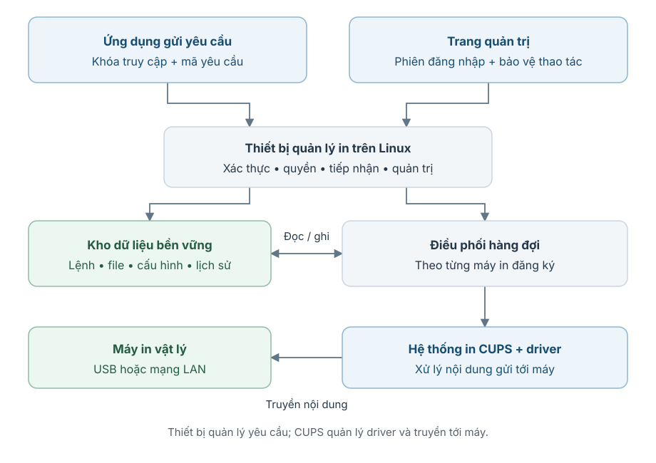
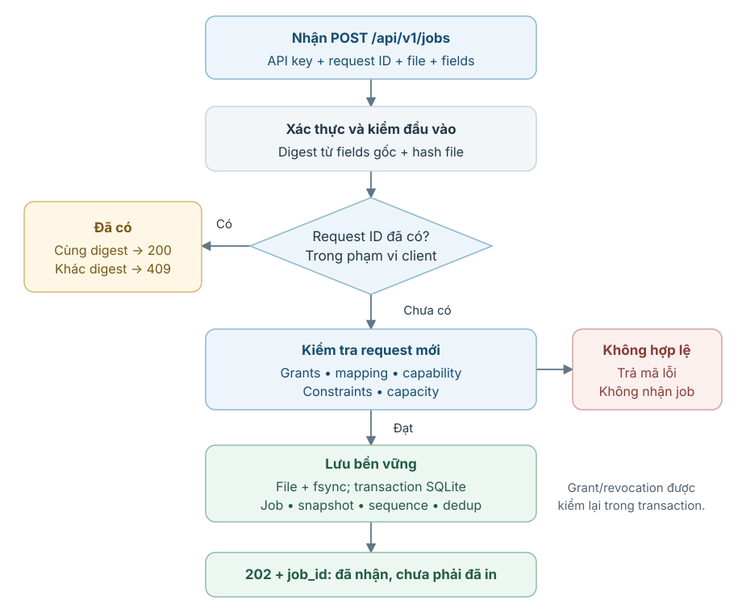
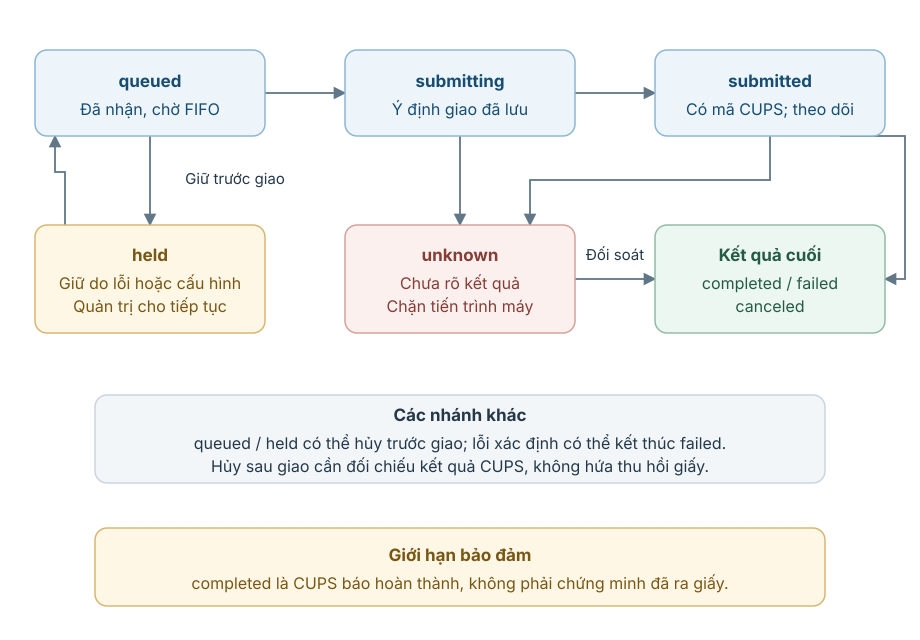
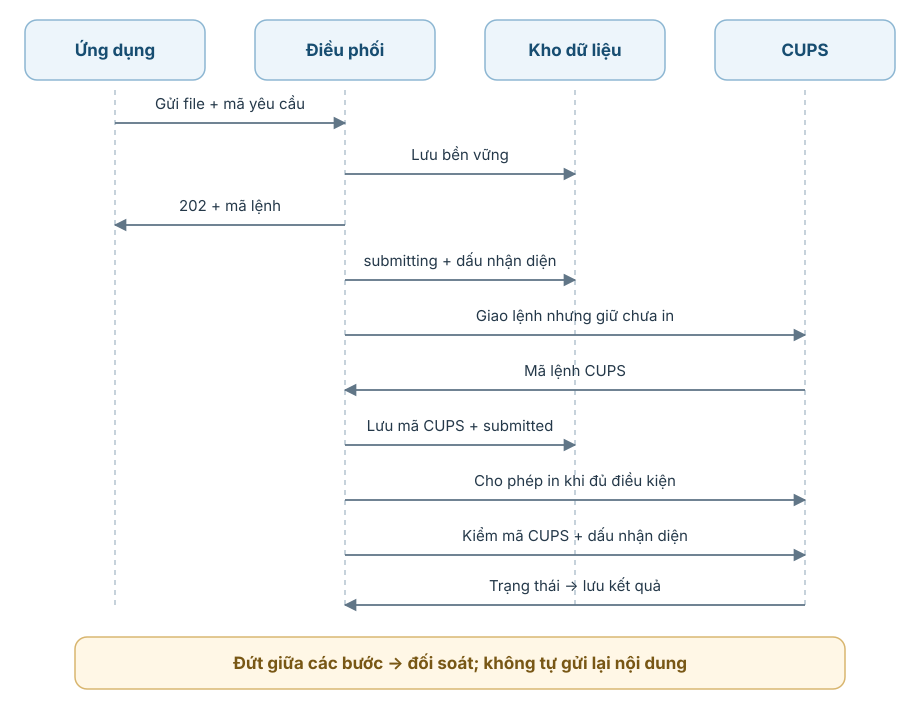
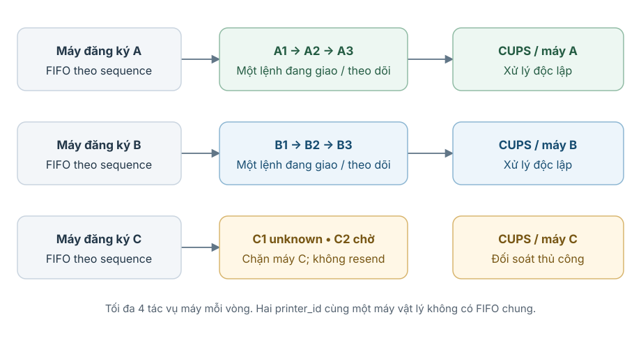
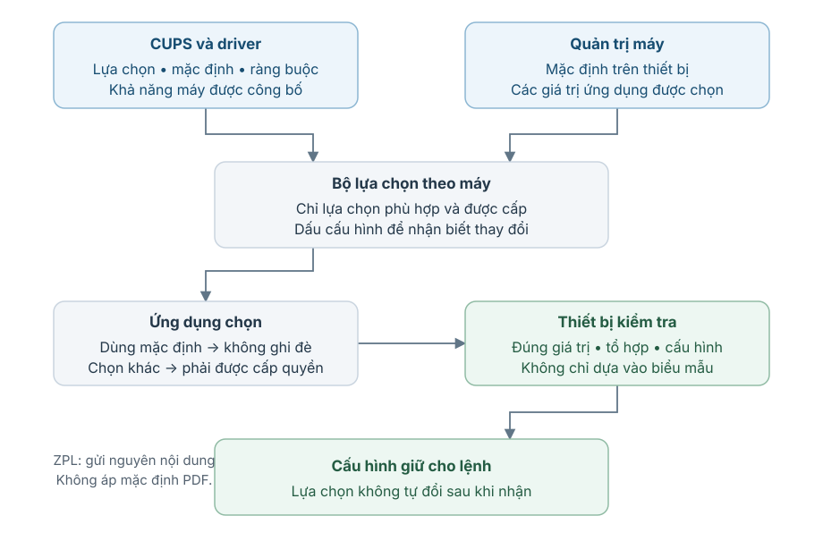
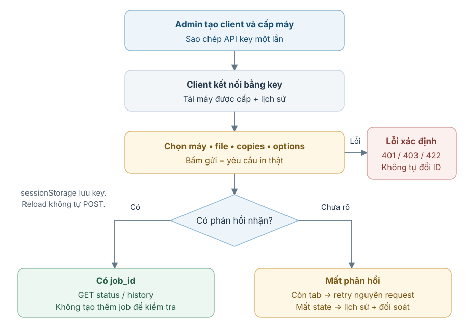
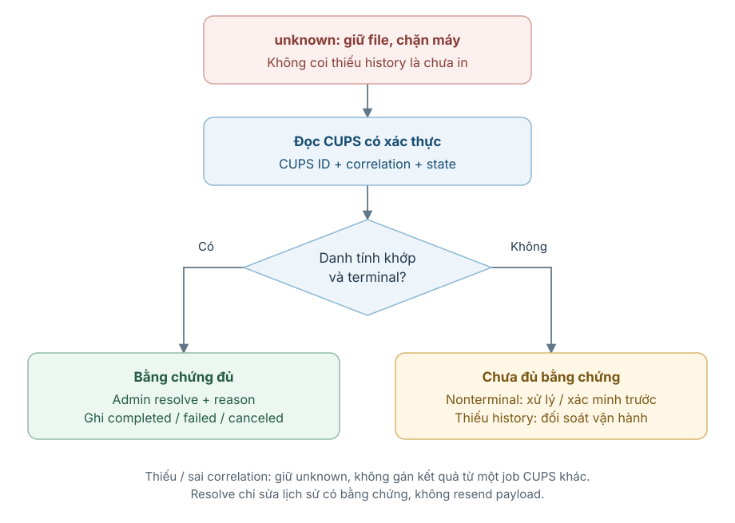
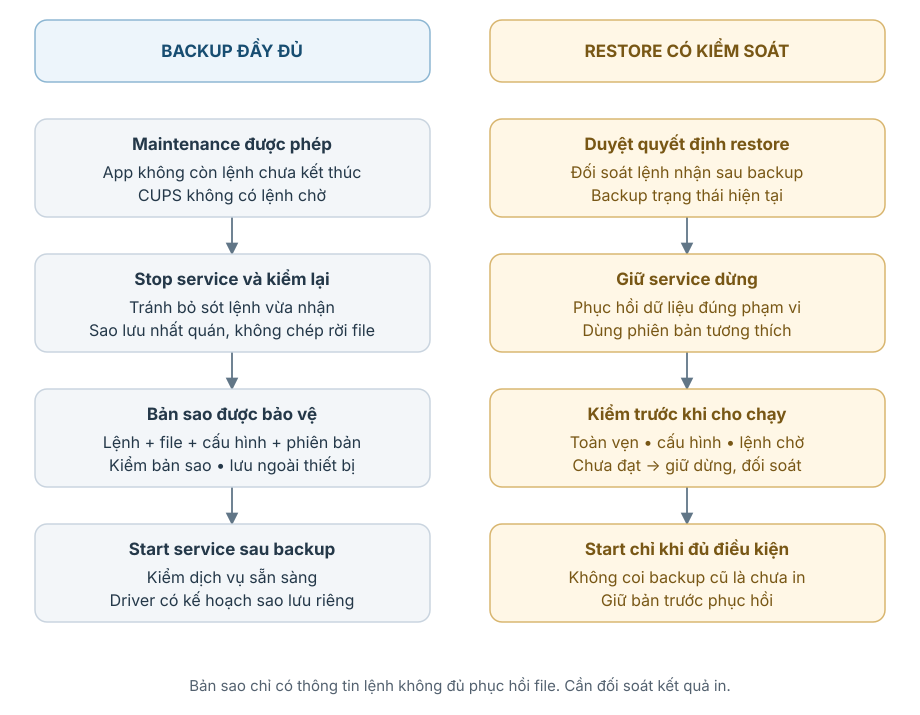
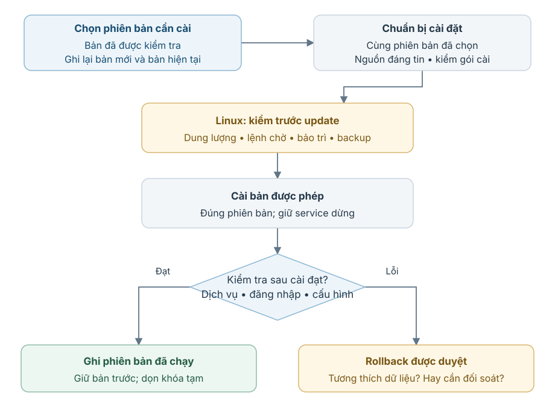

# Hướng dẫn cài đặt, sử dụng và vận hành — Print Appliance

**Thiết bị tiếp nhận, điều phối và quản lý in trong mạng nội bộ**

- **Mã tài liệu:** PA-TECH-VI.
- **Phiên bản tài liệu:** 1.3.
- **Ngày phát hành:** 06/10/2026.
- **Tác giả / đơn vị biên soạn:** Luong Nguyen · Print Appliance.
- **Phiên bản sản phẩm được mô tả:** 0.1.5.
- **Mốc chức năng đã triển khai:** `9edebaaa0ba76ce1d4ec34491e99529f155fc19f` (06/10/2026).
- **Ngôn ngữ:** Tiếng Việt.
- **Kho mã nguồn:** https://github.com/luongnguyen008/printer-server.

**Quy ước địa chỉ:** mọi IP/hostname trong tài liệu chỉ là ví dụ, không xác nhận địa chỉ của thiết bị đã triển khai. `192.0.2.10` minh họa appliance, `192.0.2.20` minh họa máy in; thay bằng địa chỉ do quản trị cung cấp. `127.0.0.1` là loopback của máy đang chạy lệnh, không phải IP truy cập Pi từ máy khác.

Tài liệu dành cho người tiếp nhận hệ thống, người quản trị và đơn vị muốn kết nối ứng dụng của mình với thiết bị in. Phần chính giải thích tổng thể theo luồng; các lệnh cài đặt và ví dụ kỹ thuật nằm ở phụ lục.

> Việc gửi yêu cầu in có thể làm máy in ra giấy thật. Chỉ thử khi đã được phép. Thao tác thay cấu hình, cài driver hoặc phục hồi dữ liệu cần kế hoạch và sao lưu phù hợp.

<!-- COVER-END -->

<h2 id="revision-history" class="front-title">Kiểm soát phiên bản tài liệu</h2>

<a id="table-1"></a>

**Bảng 1 — Lịch sử phiên bản tài liệu**

| Phiên bản tài liệu | Ngày | Người biên soạn | Nội dung thay đổi |
| --- | --- | --- | --- |
| 1.0 | 04/10/2026 | Luong Nguyen | Hướng dẫn đầu tiên: tổng thể, cài đặt, API và vận hành. Mốc tài liệu: bdb1c2b. |
| 1.1 | 04/10/2026 | Luong Nguyen | Bổ sung 10 sơ đồ luồng và hình SVG đọc offline. Mốc tài liệu: 4e37b18. |
| 1.2 | 04/10/2026 | Luong Nguyen | Chuẩn hóa cấu trúc tài liệu; viết hướng dẫn theo luồng; giới thiệu khái niệm trước khi sử dụng; bỏ hướng dẫn lập trình/test/build; chuyển lệnh cài đặt và vận hành sang phụ lục; bổ sung PDF và tra cứu số trang. |
| 1.3 | 06/10/2026 | Luong Nguyen | Đồng bộ bản React offline đã triển khai: API Guide theo tác vụ trên Client/Admin, đổi mật khẩu và thu hồi mọi phiên quản trị; chuẩn hóa ví dụ địa chỉ, mốc kiểm tra và quy tắc giữ SSH key. |

Phiên bản tài liệu và phiên bản phần mềm là hai thông tin khác nhau. Bản 1.3 mô tả chức năng ở commit `9edebaa`, vẫn mang phiên bản sản phẩm 0.1.5. Commit chỉ cập nhật tài liệu có thể mới hơn mốc chức năng; đọc `SOURCE_COMMIT` để biết commit thực tế trên thiết bị. Tài liệu được biên soạn có hỗ trợ công cụ trí tuệ nhân tạo (AI) và đối chiếu với mã nguồn, tài liệu dự án cùng các kết quả kiểm tra đã ghi nhận.

<h2 id="table-of-contents" class="front-title">Mục lục</h2>

<!-- BEGIN MAIN TOC -->
- [1. Mục đích, phạm vi và cách đọc](#1-muc-ich-pham-vi-va-cach-oc)
    - [1.1 Bài toán hệ thống giải quyết](#11-bai-toan-he-thong-giai-quyet)
    - [1.2 Phạm vi và đối tượng](#12-pham-vi-va-oi-tuong)
    - [1.3 Thứ tự đọc](#13-thu-tu-oc)
- [2. Những thành phần và khái niệm nền tảng](#2-nhung-thanh-phan-va-khai-niem-nen-tang)
    - [2.1 Người gửi, người quản trị và máy in](#21-nguoi-gui-nguoi-quan-tri-va-may-in)
    - [2.2 Lệnh in và cấu hình giữ cho lệnh](#22-lenh-in-va-cau-hinh-giu-cho-lenh)
    - [2.3 Khóa truy cập và hai loại mã](#23-khoa-truy-cap-va-hai-loai-ma)
    - [2.4 Bảng thuật ngữ cốt lõi](#24-bang-thuat-ngu-cot-loi)
- [3. Hệ thống liên lạc và phân chia trách nhiệm](#3-he-thong-lien-lac-va-phan-chia-trach-nhiem)
    - [3.1 Ứng dụng gửi yêu cầu qua đâu?](#31-ung-dung-gui-yeu-cau-qua-au)
    - [3.2 Phần mềm nào nói chuyện với máy in?](#32-phan-mem-nao-noi-chuyen-voi-may-in)
    - [3.3 Dữ liệu và hai đường truy cập](#33-du-lieu-va-hai-uong-truy-cap)
    - [3.4 File PDF và nội dung ZPL](#34-file-pdf-va-noi-dung-zpl)
- [4. Điều kiện cần chuẩn bị trước khi cài và sử dụng](#4-ieu-kien-can-chuan-bi-truoc-khi-cai-va-su-dung)
    - [4.1 Phân biệt nơi dùng với nơi chạy hệ thống in](#41-phan-biet-noi-dung-voi-noi-chay-he-thong-in)
    - [4.2 Kiểm tra trước khi triển khai](#42-kiem-tra-truoc-khi-trien-khai)
- [5. Một lệnh in đi qua hệ thống như thế nào?](#5-mot-lenh-in-i-qua-he-thong-nhu-the-nao)
    - [5.1 Tiếp nhận và chống gửi trùng](#51-tiep-nhan-va-chong-gui-trung)
    - [5.2 Các trạng thái cần phân biệt](#52-cac-trang-thai-can-phan-biet)
    - [5.3 Giao xuống CUPS và theo dõi](#53-giao-xuong-cups-va-theo-doi)
    - [5.4 Thứ tự xử lý giữa các máy](#54-thu-tu-xu-ly-giua-cac-may)
- [6. Đăng ký máy và lựa chọn in](#6-ang-ky-may-va-lua-chon-in)
    - [6.1 Hai cách đưa máy vào hệ thống](#61-hai-cach-ua-may-vao-he-thong)
    - [6.2 Khả năng, mặc định và quyền lựa chọn](#62-kha-nang-mac-inh-va-quyen-lua-chon)
    - [6.3 Khổ giấy và cách đặt nội dung PDF](#63-kho-giay-va-cach-at-noi-dung-pdf)
    - [6.4 Sửa hoặc gỡ đăng ký](#64-sua-hoac-go-ang-ky)
- [7. Cấp quyền và gửi lệnh từ client](#7-cap-quyen-va-gui-lenh-tu-client)
    - [7.1 Chuẩn bị quyền trước khi gửi](#71-chuan-bi-quyen-truoc-khi-gui)
    - [7.2 Dùng trang gửi thử](#72-dung-trang-gui-thu)
    - [7.3 Nếu mất phản hồi hoặc tải lại trang](#73-neu-mat-phan-hoi-hoac-tai-lai-trang)
    - [7.4 API Guide cho ứng dụng tích hợp](#74-api-guide-cho-ung-dung-tich-hop)
- [8. Vận hành và xử lý tình huống bất thường](#8-van-hanh-va-xu-ly-tinh-huong-bat-thuong)
    - [8.1 Kiểm tra hàng ngày](#81-kiem-tra-hang-ngay)
    - [8.2 Dừng, tiếp tục và hủy](#82-dung-tiep-tuc-va-huy)
    - [8.3 Đối soát chưa rõ kết quả](#83-oi-soat-chua-ro-ket-qua)
    - [8.4 Tra cứu lỗi theo nhóm](#84-tra-cuu-loi-theo-nhom)
    - [8.5 Đổi mật khẩu quản trị](#85-oi-mat-khau-quan-tri)
- [9. Sao lưu, cập nhật và phục hồi](#9-sao-luu-cap-nhat-va-phuc-hoi)
    - [9.1 Trước mọi thay đổi bảo trì](#91-truoc-moi-thay-oi-bao-tri)
    - [9.2 Bản sao nào đủ cho việc phục hồi?](#92-ban-sao-nao-u-cho-viec-phuc-hoi)
    - [9.3 Cập nhật một phiên bản thống nhất](#93-cap-nhat-mot-phien-ban-thong-nhat)
- [10. An toàn, giới hạn và điều kiện nghiệm thu](#10-an-toan-gioi-han-va-ieu-kien-nghiem-thu)
    - [10.1 Những bảo đảm cần hiểu đúng](#101-nhung-bao-am-can-hieu-ung)
    - [10.2 Bảo vệ quyền và dữ liệu](#102-bao-ve-quyen-va-du-lieu)
    - [10.3 Những gì đã kiểm và việc còn phải nghiệm thu](#103-nhung-gi-a-kiem-va-viec-con-phai-nghiem-thu)
- [Phụ lục A — Lấy mã nguồn và cài thiết bị](#phu-luc-a-lay-ma-nguon-va-cai-thiet-bi)
    - [A.1 Cài Git và clone project](#a1-cai-git-va-clone-project)
    - [A.2 Cài mới trên Linux/EDATEC](#a2-cai-moi-tren-linuxedatec)
        - [A.2.1 Chuẩn bị mạng và SSH](#a21-chuan-bi-mang-va-ssh)
        - [A.2.2 Ghi nhận hiện trạng trên Linux (chỉ đọc)](#a22-ghi-nhan-hien-trang-tren-linux-chi-oc)
        - [A.2.3 Cài dependency hệ thống](#a23-cai-dependency-he-thong)
        - [A.2.4 Tạo user và thư mục mới](#a24-tao-user-va-thu-muc-moi)
        - [A.2.5 Cài phần mềm từ project trên thiết bị](#a25-cai-phan-mem-tu-project-tren-thiet-bi)
        - [A.2.6 Kiểm tra cài đặt trước khi chạy](#a26-kiem-tra-cai-at-truoc-khi-chay)
        - [A.2.7 Đặt mật khẩu, cài service loopback](#a27-at-mat-khau-cai-service-loopback)
        - [A.2.8 Truy cập an toàn từ máy cá nhân](#a28-truy-cap-an-toan-tu-may-ca-nhan)
        - [A.2.9 Chốt cài đặt](#a29-chot-cai-at)
- [Phụ lục B — Driver, cấu hình máy và giới hạn](#phu-luc-b-driver-cau-hinh-may-va-gioi-han)
    - [B.1 — Cấu hình máy in và driver](#b1-cau-hinh-may-in-va-driver)
        - [B.1.1 Kiểm tra kết nối trước](#b11-kiem-tra-ket-noi-truoc)
        - [B.1.2 Driver Canon LBP6230dw trên ARM64](#b12-driver-canon-lbp6230dw-tren-arm64)
        - [B.1.3 Thêm máy trong UI](#b13-them-may-trong-ui)
        - [B.1.4 Sửa và xóa](#b14-sua-va-xoa)
    - [B.2 — Tùy chọn in theo capability](#b2-tuy-chon-in-theo-capability)
        - [B.2.1 Khổ giấy, duplex và căn PDF](#b21-kho-giay-duplex-va-can-pdf)
        - [B.2.2 Schema unavailable hoặc stale](#b22-schema-unavailable-hoac-stale)
    - [B.3 — Cấu hình runtime và giới hạn](#b3-cau-hinh-runtime-va-gioi-han)
        - [B.3.1 Biến môi trường/CLI](#b31-bien-moi-truongcli)
        - [B.3.2 Giới hạn qua web](#b32-gioi-han-qua-web)
- [Phụ lục C — API và ví dụ tích hợp](#phu-luc-c-api-va-vi-du-tich-hop)
    - [C.1 — API client: hợp đồng và kết quả](#c1-api-client-hop-ong-va-ket-qua)
        - [C.1.1 Multipart của job mới](#c11-multipart-cua-job-moi)
        - [C.1.2 Mã lỗi](#c12-ma-loi)
    - [C.2 — Gọi API từ macOS và Windows](#c2-goi-api-tu-macos-va-windows)
        - [C.2.1 macOS: biến, key và danh sách](#c21-macos-bien-key-va-danh-sach)
        - [C.2.2 Windows PowerShell: gọi bằng curl.exe](#c22-windows-powershell-goi-bang-curlexe)
        - [C.2.3 PDF options và ZPL](#c23-pdf-options-va-zpl)
    - [C.3 — API quản trị và tích hợp Odoo/PDA](#c3-api-quan-tri-va-tich-hop-odoopda)
        - [C.3.1 Quản trị](#c31-quan-tri)
        - [C.3.2 Mẫu luồng tích hợp](#c32-mau-luong-tich-hop)
- [Phụ lục D — Runbook vận hành và bảo trì](#phu-luc-d-runbook-van-hanh-va-bao-tri)
    - [D.1 — Vận hành hàng ngày và xử lý sự cố](#d1-van-hanh-hang-ngay-va-xu-ly-su-co)
        - [D.1.1 Các kiểm tra thường dùng trên Linux](#d11-cac-kiem-tra-thuong-dung-tren-linux)
        - [D.1.2 Pause, resume, cancel](#d12-pause-resume-cancel)
        - [D.1.3 Unknown và job identity](#d13-unknown-va-job-identity)
        - [D.1.4 Bảng lỗi nhanh](#d14-bang-loi-nhanh)
    - [D.2 — Sao lưu và phục hồi](#d2-sao-luu-va-phuc-hoi)
        - [D.2.1 Backup SQLite online](#d21-backup-sqlite-online)
        - [D.2.2 Backup đầy đủ khi đã maintenance](#d22-backup-ay-u-khi-a-maintenance)
        - [D.2.3 Restore có kiểm soát](#d23-restore-co-kiem-soat)
    - [D.3 Cập nhật và quay lại phiên bản trước](#d3-cap-nhat-va-quay-lai-phien-ban-truoc)
- [Phụ lục E — Thuật ngữ và viết tắt bổ sung](#phu-luc-e-thuat-ngu-va-viet-tat-bo-sung)
- [Phụ lục F — Checklist bàn giao và sử dụng tài liệu](#phu-luc-f-checklist-ban-giao-va-su-dung-tai-lieu)
    - [F.1 — Checklist chạy từ đầu](#f1-checklist-chay-tu-au)
    - [F.2 Đọc và tra cứu tài liệu](#f2-oc-va-tra-cuu-tai-lieu)
- [Tài liệu tham khảo](#tai-lieu-tham-khao)
- [Chỉ mục tra cứu](#chi-muc-tra-cuu)
<!-- END MAIN TOC -->

Số trang trong HTML tham chiếu bản PDF chuẩn đi kèm. Markdown dùng liên kết đến từng mục. Nếu tự in HTML với cỡ giấy, font hoặc thiết lập khác, số trang có thể thay đổi.

<h2 id="list-of-figures" class="front-title">Danh mục hình</h2>

<!-- BEGIN FIGURE LIST -->
- [Hình 1 — Kiến trúc tổng thể](#figure-1)
- [Hình 2 — Tiếp nhận và chống gửi trùng](#figure-2)
- [Hình 3 — Vòng đời lệnh in](#figure-3)
- [Hình 4 — Giao CUPS có kiểm soát](#figure-4)
- [Hình 5 — Hàng đợi theo máy](#figure-5)
- [Hình 6 — Lựa chọn và quyền sử dụng](#figure-6)
- [Hình 7 — Cấp quyền và gửi lệnh](#figure-7)
- [Hình 8 — Đối soát chưa rõ kết quả](#figure-8)
- [Hình 9 — Sao lưu và phục hồi](#figure-9)
- [Hình 10 — Cập nhật và rollback](#figure-10)
<!-- END FIGURE LIST -->

<h2 id="list-of-tables" class="front-title">Danh mục bảng</h2>

<!-- BEGIN TABLE LIST -->
- [Bảng 1 — Lịch sử phiên bản tài liệu](#table-1)
- [Bảng 2 — Thuật ngữ cốt lõi](#table-2)
- [Bảng 3 — Môi trường và vai trò triển khai](#table-3)
- [Bảng 4 — Trạng thái của lệnh in](#table-4)
- [Bảng 5 — Ví dụ tùy chọn và giới hạn driver](#table-5)
- [Bảng 6 — Biến cấu hình runtime](#table-6)
- [Bảng 7 — Giới hạn có thể chỉnh qua web](#table-7)
- [Bảng 8 — Các API của client](#table-8)
- [Bảng 9 — Trường của một yêu cầu in](#table-9)
- [Bảng 10 — Mã phản hồi và cách xử lý](#table-10)
- [Bảng 11 — Nhóm API quản trị](#table-11)
- [Bảng 12 — Bảng tra cứu sự cố](#table-12)
- [Bảng 13 — Thuật ngữ kỹ thuật bổ sung](#table-13)
<!-- END TABLE LIST -->

<!-- FRONT-MATTER-END -->

<a name="1-muc-ich-pham-vi-va-cach-oc" class="heading-anchor"></a>

## 1. Mục đích, phạm vi và cách đọc

<a name="11-bai-toan-he-thong-giai-quyet" class="heading-anchor"></a>

### 1.1 Bài toán hệ thống giải quyết

Khi nhiều ứng dụng cần dùng chung máy in, mỗi ứng dụng không nên phải tự cài và quản lý kết nối với từng máy. Print Appliance đặt một thiết bị quản lý tại nơi in để nhận yêu cầu, xếp thứ tự xử lý và ghi lại kết quả.

**Thiết bị quản lý in** là máy tính đứng giữa ứng dụng gửi yêu cầu và máy in vật lý. Trong triển khai được mô tả, thiết bị này là EDATEC. EDATEC chạy phần mềm Print Appliance; bản thân EDATEC không phải máy in.

Hệ thống làm ba việc: nhận đúng yêu cầu từ đúng người gửi, điều phối yêu cầu tới đúng máy, và cho người quản trị biết yêu cầu đang ở bước nào. Một phản hồi “đã nhận” chưa có nghĩa giấy đã ra khỏi máy.

<a name="12-pham-vi-va-oi-tuong" class="heading-anchor"></a>

### 1.2 Phạm vi và đối tượng

Phạm vi hiện tại là một thiết bị hoạt động trong **mạng nội bộ**: mạng của văn phòng, kho hoặc nơi đặt máy in. Tài liệu không hướng dẫn công bố dịch vụ ra Internet hay vận hành nhiều thiết bị như một cụm.

Người sử dụng cần biết cách chọn máy và gửi file. Người quản trị cần hiểu quyền truy cập, hàng đợi, lỗi và bảo trì. Đơn vị tích hợp cần hiểu cách ứng dụng gửi yêu cầu và kiểm tra kết quả. Không cần đọc cách tổ chức mã nguồn để hiểu phần chính. Đây là hướng dẫn cài đặt, sử dụng và vận hành, không phải tài liệu dạy lập trình.

<a name="13-thu-tu-oc" class="heading-anchor"></a>

### 1.3 Thứ tự đọc

Đọc mục 2–4 để hiểu thành phần, cách liên lạc và điều kiện cần chuẩn bị. Mục 5 giải thích một yêu cầu đi qua hệ thống như thế nào; mục 6–8 đi từ cấu hình đến sử dụng và xử lý lỗi. Mục 9–10 dành cho bảo trì, an toàn và nghiệm thu.

Sau khi hiểu luồng, dùng phụ lục đúng việc cần làm: A để cài đặt; B để cấu hình máy và giới hạn; C để tích hợp ứng dụng; D để vận hành/bảo trì. Phụ lục E giải nghĩa thuật ngữ kỹ thuật bổ sung. Phụ lục F cung cấp thông tin bàn giao và cách tái tạo tài liệu.

<a name="2-nhung-thanh-phan-va-khai-niem-nen-tang" class="heading-anchor"></a>

## 2. Những thành phần và khái niệm nền tảng

<a name="21-nguoi-gui-nguoi-quan-tri-va-may-in" class="heading-anchor"></a>

### 2.1 Người gửi, người quản trị và máy in

**Ứng dụng gửi yêu cầu**, gọi ngắn là **client**, là ứng dụng được cấp quyền sử dụng thiết bị quản lý in. Client có thể là phần mềm nghiệp vụ hoặc trang gửi thử của sản phẩm; không nhất thiết là một người dùng.

**Người quản trị** là người đăng nhập trang quản lý để đăng ký máy, cấp quyền cho client và xử lý các tình huống cần quyết định. Tài khoản quản trị không phải danh tính client.

**Máy in vật lý** là thiết bị thật làm ra bản in. **Máy in đăng ký** là thông tin đại diện cho máy đó trong Print Appliance, gồm tên, kết nối và lựa chọn in. Mỗi đăng ký có một mã ổn định, gọi là **mã máy**; Dữ liệu trao đổi dùng tên trường `printer_id` cho mã này.

Máy đăng ký có thể sửa cấu hình mà không đổi mã máy. Tuy nhiên, hệ thống không được âm thầm đổi nơi in của một yêu cầu đã nhận. Vì vậy cần phân biệt đăng ký hiện tại với cấu hình đã được giữ cho từng yêu cầu.

<a name="22-lenh-in-va-cau-hinh-giu-cho-lenh" class="heading-anchor"></a>

### 2.2 Lệnh in và cấu hình giữ cho lệnh

**Lệnh in** là yêu cầu đã được thiết bị nhận và lưu, gồm file (tệp nội dung cần in), máy được chọn, số bản, lựa chọn in và người gửi. Hệ thống cấp **mã lệnh** để tra cứu lệnh; Dữ liệu trao đổi gọi trường này là `job_id`.

**Ảnh chụp cấu hình**, hay **snapshot**, là bản cấu hình được giữ cho một lệnh tại thời điểm nhận. Tên gọi này không chỉ ảnh chụp màn hình: nó là dữ liệu về nơi in và các lựa chọn có hiệu lực. Sửa mặc định của máy sau đó không tự thay lựa chọn của lệnh cũ.

**Hàng đợi** là danh sách lệnh chờ xử lý. Mỗi máy đăng ký có thứ tự riêng. “Đã nhận”, “đang xử lý” và “đã hoàn thành” là các bước khác nhau trong vòng đời lệnh.

<a name="23-khoa-truy-cap-va-hai-loai-ma" class="heading-anchor"></a>

### 2.3 Khóa truy cập và hai loại mã

**API** là giao diện để ứng dụng gửi yêu cầu và nhận phản hồi từ thiết bị. **Khóa truy cập client**, hay **API key**, là chuỗi bí mật giúp hệ thống nhận biết client. Người quản trị cấp khóa này cho ứng dụng; phải giữ nó như mật khẩu. Khóa client khác mật khẩu dùng đăng nhập trang quản trị và khác mật khẩu kết nối tới hệ điều hành của thiết bị.

**Mã yêu cầu** do client đặt trước khi gửi để nhận diện một thao tác in. Khi gửi lại vì mất kết nối, client phải giữ mã này cùng file và các tham số gốc. Đây là cách tránh tạo thêm lệnh cho cùng một yêu cầu; cơ chế đó gọi là **chống gửi trùng**.

Mã yêu cầu không phải mã lệnh: mã yêu cầu có trước khi gửi; mã lệnh do thiết bị cấp sau khi nhận. Mã yêu cầu cũng không phải khóa truy cập, vì nó không dùng để chứng minh danh tính.

<a name="24-bang-thuat-ngu-cot-loi" class="heading-anchor"></a>

### 2.4 Bảng thuật ngữ cốt lõi

<a id="table-2"></a>

**Bảng 2 — Thuật ngữ cốt lõi**

| Khái niệm | Hiểu ngắn gọn | Không đồng nghĩa với |
| --- | --- | --- |
| Thiết bị quản lý in | Nhận và điều phối yêu cầu tại nơi in | Máy in vật lý |
| Client | Ứng dụng được cấp danh tính gửi yêu cầu | Tài khoản quản trị |
| Máy in đăng ký | Thông tin đại diện máy trong hệ thống | Chỉ một địa chỉ mạng |
| Lệnh in | Yêu cầu đã được nhận và lưu | Một lần gửi qua mạng |
| Snapshot | Cấu hình giữ cho một lệnh | Cấu hình mới nhất của máy |
| Khóa truy cập | Chứng minh danh tính client | Mã yêu cầu hay mã lệnh |
| Mã yêu cầu | Nhận diện thao tác, dùng chống trùng | Mã lệnh do thiết bị cấp |

<a name="3-he-thong-lien-lac-va-phan-chia-trach-nhiem" class="heading-anchor"></a>

## 3. Hệ thống liên lạc và phân chia trách nhiệm

<a name="31-ung-dung-gui-yeu-cau-qua-au" class="heading-anchor"></a>

### 3.1 Ứng dụng gửi yêu cầu qua đâu?

**API** là giao diện để ứng dụng gửi yêu cầu và nhận phản hồi từ một phần mềm khác. Client dùng API của Print Appliance thay vì tự liên lạc với driver của máy in.

API ở đây dùng **HTTP**, giao thức trao đổi yêu cầu/phản hồi cũng được trình duyệt dùng khi mở trang web. Phản hồi có mã số để phân biệt kết quả: chẳng hạn **202** nghĩa là lệnh mới đã được nhận, **200** có thể là kết quả của yêu cầu đã nhận trước đó, và **409** báo cùng mã yêu cầu nhưng nội dung không khớp. Các mã cụ thể được tra cứu ở phụ lục C.

Người dùng có thể thao tác qua trang gửi thử thay vì viết chương trình. Trang gửi thử cũng hoạt động như một client, không được tự có quyền quản trị hoặc quyền dùng mọi máy.

<a name="32-phan-mem-nao-noi-chuyen-voi-may-in" class="heading-anchor"></a>

### 3.2 Phần mềm nào nói chuyện với máy in?

Thiết bị chạy **Linux**, một hệ điều hành. Print Appliance quản lý quyền, tiếp nhận, hàng đợi và lịch sử. **CUPS** là hệ thống in chạy trên Linux, chịu trách nhiệm hàng đợi cấp hệ thống và truyền dữ liệu đến máy.

**Driver máy in** là phần mềm giúp hệ thống in xử lý nội dung theo ngôn ngữ máy hiểu. Driver phải đúng dòng máy và đúng môi trường của thiết bị; driver dành cho Windows không thay được driver Linux trên EDATEC.

Kết nối tới máy có thể dùng cáp **USB**, cổng nối trực tiếp với thiết bị, hoặc mạng nội bộ, thường viết tắt là **LAN**. Máy tính cá nhân mở được trang quản trị không chứng minh thiết bị quản lý in đã kết nối được tới máy in.

<a name="33-du-lieu-va-hai-uong-truy-cap" class="heading-anchor"></a>

### 3.3 Dữ liệu và hai đường truy cập

**Lưu bền vững** nghĩa là lệnh và file được ghi an toàn vào bộ nhớ lưu trữ trước khi báo đã nhận; dữ liệu không chỉ tồn tại trong bộ nhớ tạm của chương trình. Điều này giúp khôi phục trạng thái sau khi phần mềm khởi động lại, nhưng không làm việc in vật lý trở thành một giao dịch có thể hoàn tác.

Client dùng khóa truy cập và chỉ dùng máy được cấp. Người quản trị dùng một **phiên đăng nhập**, tức trạng thái hệ thống ghi nhận sau khi đăng nhập đúng mật khẩu. Thao tác quản trị còn có kiểm tra bảo vệ để hạn chế việc một trang khác gửi thao tác thay người đã đăng nhập.

<a id="figure-1"></a>



_Hình 1 — Ứng dụng gửi yêu cầu, Print Appliance nhận và điều phối, CUPS xử lý driver và truyền tới máy. Hai đường truy cập có quyền riêng._

<a name="34-file-pdf-va-noi-dung-zpl" class="heading-anchor"></a>

### 3.4 File PDF và nội dung ZPL

**PDF** là định dạng tài liệu trang thường dùng cho hướng dẫn hoặc phiếu in. CUPS cùng driver phù hợp xử lý PDF để gửi đến máy.

**ZPL** là ngôn ngữ lệnh dành cho các máy in nhãn có hỗ trợ nó. ZPL không phải một loại PDF và không được tự chuyển thành nội dung mà mọi máy in đều hiểu. Chỉ cấp định dạng này cho máy đã xác minh hỗ trợ.

Sản phẩm nhận hai loại trên nhưng không thiết kế biểu mẫu, không chuyển PDF thành ZPL và không cung cấp phần mềm quản lý kho. Nếu một ứng dụng nghiệp vụ tạo file, ứng dụng đó vẫn chịu trách nhiệm nội dung file.

<a name="4-ieu-kien-can-chuan-bi-truoc-khi-cai-va-su-dung" class="heading-anchor"></a>

## 4. Điều kiện cần chuẩn bị trước khi cài và sử dụng

<a name="41-phan-biet-noi-dung-voi-noi-chay-he-thong-in" class="heading-anchor"></a>

### 4.1 Phân biệt nơi dùng với nơi chạy hệ thống in

Trình duyệt trên máy cá nhân dùng để quản trị hoặc gửi thử. Thiết bị Linux là nơi chạy hệ thống in thật. Việc chọn máy cá nhân để phát triển không thay đổi nơi đặt driver và kết nối vật lý.

Không cần cài môi trường lập trình trên Mac/Windows để sử dụng hệ thống hoặc lấy mã nguồn. Trình duyệt dùng để quản trị và gửi thử; công cụ gọi API phục vụ đơn vị tích hợp. Bản này không hướng dẫn chạy hệ thống in trực tiếp trên Windows.

<a id="table-3"></a>

**Bảng 3 — Môi trường và vai trò triển khai**

| Môi trường | Việc phù hợp | Giới hạn |
| --- | --- | --- |
| macOS | Đọc tài liệu, dùng web/API và lấy mã nguồn | Không dùng CUPS của Mac làm môi trường triển khai được chứng nhận |
| Windows | Dùng trình duyệt và gọi API; quản trị thiết bị từ xa | Không cài phần mềm in trực tiếp trên Windows |
| Linux trên thiết bị | Chạy Print Appliance, CUPS và driver | Từng model, kiến trúc phần cứng và quyền kết nối phải được kiểm tra |

<a name="42-kiem-tra-truoc-khi-trien-khai" class="heading-anchor"></a>

### 4.2 Kiểm tra trước khi triển khai

Triển khai đã dùng Debian 12, một bản phân phối Linux, với Python 3.11 trên EDATEC ARM64. **Python** là môi trường thực thi phần mềm; **ARM64** là kiến trúc bộ xử lý, giúp chọn đúng gói driver. Đây là thông tin của môi trường đã kiểm tra, không phải bảo đảm mọi thiết bị Linux tương thích.

Cần nguồn điện ổn định, bộ nhớ lưu trữ có chỗ trống cho file chờ in, kết nối mạng phù hợp và driver đúng dòng máy. Chưa có đo kiểm hiệu năng để cam kết một mức bộ nhớ/bộ xử lý hoặc dung lượng tối thiểu cho mọi khối lượng in; phải đánh giá theo số lệnh và kích thước file thực tế.

Lần cài đầu cần công cụ và gói phần mềm từ Internet, trừ khi đã chuẩn bị bộ cài riêng. Sau khi cài đầy đủ, trang quản trị không cần tải font hoặc thư viện ngoài để hoạt động. Địa chỉ mạng của thiết bị nên ổn định; đừng coi IP ví dụ trong tài liệu là địa chỉ bắt buộc.

Trước cài đặt, ghi nhận cấu hình hiện tại, sao lưu phần liên quan và thống nhất phạm vi thay đổi. Cài driver có thể restart CUPS, ảnh hưởng các lệnh đang dùng hệ thống in. Phụ lục A/B cung cấp lệnh chi tiết sau khi các điều kiện này đã được đáp ứng.

<a name="5-mot-lenh-in-i-qua-he-thong-nhu-the-nao" class="heading-anchor"></a>

## 5. Một lệnh in đi qua hệ thống như thế nào?

<a name="51-tiep-nhan-va-chong-gui-trung" class="heading-anchor"></a>

### 5.1 Tiếp nhận và chống gửi trùng

Client chuẩn bị file, mã máy, số bản, lựa chọn in và một mã yêu cầu mới. Thiết bị xác thực khóa truy cập rồi kiểm quyền, định dạng, cấu hình và sức chứa.

Hệ thống tạo **dấu nhận dạng nội dung**, là giá trị kiểm tra được tính từ file và các tham số gốc. Nếu mã yêu cầu đã tồn tại trong phạm vi client, dấu nhận dạng khớp thì trả lại lệnh cũ; không khớp thì báo xung đột. Khi một yêu cầu được nhận lần đầu, hệ thống lưu file, lệnh và snapshot trước khi trả mã lệnh.

<a id="figure-2"></a>



_Hình 2 — Gửi lại cùng mã và nội dung không tạo thêm một lệnh. 202 xác nhận đã nhận, chưa xác nhận giấy đã in._

<a name="52-cac-trang-thai-can-phan-biet" class="heading-anchor"></a>

### 5.2 Các trạng thái cần phân biệt

Tên trạng thái tiếng Anh trong web/API là định danh thống nhất, được giải thích dưới đây. **Kết thúc** nghĩa là hệ thống đã ghi nhận một kết quả cuối; lệnh chưa rõ kết quả vẫn chưa được coi là kết thúc.

<a id="table-4"></a>

**Bảng 4 — Trạng thái của lệnh in**

| Trạng thái | Ý nghĩa với người vận hành | Hành động phù hợp |
| --- | --- | --- |
| queued | Đã lưu, đang chờ đến lượt | Theo dõi hàng đợi; có thể hủy trước giao |
| held | Đang giữ do quyết định quản trị, lỗi hoặc cấu hình | Sửa nguyên nhân rồi quản trị cho tiếp tục |
| submitting | Đang giao; kết quả lần giao chưa được chốt | Chờ đối soát, không tạo bản sao |
| submitted | Có lệnh trong CUPS; mã lệnh CUPS đã lưu để theo dõi | Xem kết quả; hủy sau giao cần xác nhận |
| completed | CUPS báo hoàn thành | Không mặc nhiên chứng minh mọi trang đã ra giấy |
| failed | Kết thúc với lỗi xác định | Xem lý do trước khi quyết định gửi lệnh mới |
| canceled | Đã ghi nhận hủy | Không thu hồi giấy đã in |
| unknown | Chưa đủ bằng chứng về lần giao hoặc kết quả | Giữ file, chặn máy tương ứng, đối soát thủ công |

<a id="figure-3"></a>



_Hình 3 — Sơ đồ nghiệp vụ rút gọn. Unknown không phải lỗi được tự gửi lại để thử._

<a name="53-giao-xuong-cups-va-theo-doi" class="heading-anchor"></a>

### 5.3 Giao xuống CUPS và theo dõi

Một lệnh có mã do Print Appliance cấp; khi giao xuống CUPS, CUPS còn cấp một mã riêng. **Dấu nhận diện đối soát**, gọi là **correlation**, nối hai bản ghi này với nhau để tránh đọc nhầm kết quả của một lệnh khác.

Luồng bình thường là ghi ý định giao, tạo lệnh trong CUPS ở trạng thái giữ chưa in, lưu mã CUPS, rồi mới cho phép in nếu đủ điều kiện. Sau đó hệ thống đọc trạng thái CUPS và đối chiếu mã cùng dấu nhận diện để cập nhật kết quả.

<a id="figure-4"></a>



_Hình 4 — Báo đã nhận cho client và cho CUPS bắt đầu in là hai thời điểm khác nhau. Khi đứt giữa các bước, cần đối soát thay vì gửi lại nội dung._

<a name="54-thu-tu-xu-ly-giua-cac-may" class="heading-anchor"></a>

### 5.4 Thứ tự xử lý giữa các máy

**FIFO** nghĩa là nhận trước xử lý trước. Print Appliance áp thứ tự này theo từng máy đăng ký. Trong một vòng điều phối, có thể xử lý độc lập tối đa bốn máy; không có nghĩa bốn lệnh được giao cùng lúc tới một máy.

Lệnh unknown chặn máy liên quan, không tự làm các máy khác dừng. Nếu nhiều đăng ký cùng trỏ một máy vật lý, chúng không tạo hàng đợi FIFO chung. Vì vậy nên dùng một đích đăng ký dành riêng cho một máy và tránh nguồn gửi khác dùng chung hàng đợi CUPS.

<a id="figure-5"></a>



_Hình 5 — Máy C cần đối soát không ngăn máy A/B xử lý. Thứ tự riêng không thay thế giới hạn của máy vật lý._

<a name="6-ang-ky-may-va-lua-chon-in" class="heading-anchor"></a>

## 6. Đăng ký máy và lựa chọn in

<a name="61-hai-cach-ua-may-vao-he-thong" class="heading-anchor"></a>

### 6.1 Hai cách đưa máy vào hệ thống

Quản trị có thể tạo cấu hình mới để Print Appliance tạo hàng đợi CUPS dành riêng, hoặc nhập một hàng đợi CUPS đã có. Đây là hai cách thay thế nhau, không phải hai bước bắt buộc.

**Khám phá thiết bị** là việc CUPS liệt kê máy/kết nối có thể nhận biết. **Địa chỉ kết nối** xác định nơi CUPS gửi nội dung, không phải mã máy đăng ký. Chọn được thiết bị chưa chứng minh driver đúng; thấy driver chưa chứng minh đã in ra giấy.

Máy nhập từ hàng đợi có sẵn bắt đầu ở trạng thái giữ trong app; người quản trị phải kiểm tra chính sách và quyết định tiếp tục. Không dùng chung hàng đợi với hệ thống khác đang gửi lệnh ngoài Print Appliance.

Thực hiện trên trang quản trị:

1. Vào **Máy in → Thêm máy in**.
2. Chọn tạo cấu hình mới hoặc nhập cấu hình CUPS đã có.
3. Chọn thiết bị/kết nối và driver đúng dòng máy đã cài.
4. Chỉ chọn PDF hoặc ZPL phù hợp với máy.
5. Lưu rồi mở chi tiết để kiểm tên, kết nối và driver. Nếu đang giữ, đọc lý do trước khi cho tiếp tục.

Không lấy việc lưu thành công làm bằng chứng đã in được; thử giấy là bước nghiệm thu riêng.

<a name="62-kha-nang-mac-inh-va-quyen-lua-chon" class="heading-anchor"></a>

### 6.2 Khả năng, mặc định và quyền lựa chọn

**Khả năng in**, gọi là **capability**, là các lựa chọn và tổ hợp driver/CUPS công bố. Ví dụ: khổ giấy, in hai mặt và loại giấy. **In hai mặt**, hay **duplex**, có thể cần loại giấy và mép lật phù hợp.

Ba lớp phải được tách rõ: máy hỗ trợ gì; quản trị đặt mặc định gì; client được đổi những giá trị nào. **Ràng buộc tổ hợp** là điều kiện khiến hai lựa chọn riêng lẻ hợp lệ nhưng không dùng được cùng nhau. Hệ thống phải kiểm tra cả tổ hợp, không chỉ từng ô chọn.

<a id="figure-6"></a>



_Hình 6 — Form giúp chọn đúng nhưng thiết bị vẫn kiểm tra lại. Cấu hình có hiệu lực được giữ cho lệnh, không tự thay sau khi nhận._

<a name="63-kho-giay-va-cach-at-noi-dung-pdf" class="heading-anchor"></a>

### 6.3 Khổ giấy và cách đặt nội dung PDF

Client chọn dùng mặc định thì không ghi đè lựa chọn đó. Nếu không được cấp lựa chọn khác, vẫn có thể gửi với mặc định khi cấu hình được xác minh hợp lệ. ZPL gửi nội dung nguyên bản và không nhận các tùy chọn xử lý PDF.

**Fit** hướng tới giữ nội dung trong vùng in; **fill** hướng tới lấp vùng và có thể cắt một phần; **none** không yêu cầu đổi tỷ lệ. Các lựa chọn chỉ được dùng khi hệ thống in công bố hỗ trợ. Vùng in thực tế có thể có lề, nên “đầy trang” không phải cam kết in không viền.

<a name="64-sua-hoac-go-ang-ky" class="heading-anchor"></a>

### 6.4 Sửa hoặc gỡ đăng ký

Đổi kết nối hoặc driver có thể làm snapshot của lệnh cũ không còn khớp; hệ thống giữ lệnh thay vì tự đổi đường in. Việc gỡ đăng ký chỉ gỡ khỏi app, không tự xóa hàng đợi CUPS hoặc lịch sử.

Gỡ máy hoặc xóa client bị chặn khi còn lệnh chưa kết thúc. Đăng ký lại sau khi gỡ tạo một mã máy mới, không tự phục hồi quyền cũ. Chi tiết các trường và driver nằm ở phụ lục B.

<a name="7-cap-quyen-va-gui-lenh-tu-client" class="heading-anchor"></a>

## 7. Cấp quyền và gửi lệnh từ client

<a name="71-chuan-bi-quyen-truoc-khi-gui" class="heading-anchor"></a>

### 7.1 Chuẩn bị quyền trước khi gửi

Thực hiện trên trang quản trị:

1. Vào **Clients → Thêm client**, đặt tên dễ nhận biết ứng dụng/người dùng thử.
2. Trong **Máy được cấp**, tìm và tích các máy client được dùng; kiểm lại các lựa chọn đã chọn.
3. Lưu, sao chép khóa truy cập trong cửa sổ hiện một lần và chuyển qua kênh an toàn.
4. Nếu client chưa có máy, dùng **Sửa client** để cấp máy rồi lưu; không cần đổi khóa chỉ để thay quyền.

Không có quyền máy thì client vẫn có thể xác thực nhưng không có máy để chọn.

**Thu hồi khóa** ngăn yêu cầu mới dùng khóa đó; không tự hủy lệnh đã được nhận. **Đổi khóa** cấp khóa thay thế, cần cập nhật ứng dụng đang dùng. Lịch sử và dữ liệu chống trùng không bị xóa chỉ vì xóa client.

<a name="72-dung-trang-gui-thu" class="heading-anchor"></a>

### 7.2 Dùng trang gửi thử

Trang quản trị ở `/`; trang gửi thử ở `/client`. Dấu `/` biểu thị đường dẫn trên cùng địa chỉ web của thiết bị. Trang gửi thử dùng khóa client, không dùng mật khẩu quản trị.

Dùng địa chỉ thiết bị do người quản trị cung cấp. Ví dụ `http://192.0.2.10:8081/` là trang quản trị, thêm `client` sau dấu `/` để mở trang gửi thử; IP này chỉ là ví dụ.

1. Mở trang `/client`, nhập khóa truy cập và bấm **Kết nối**.
2. Chọn một máy được cấp. Danh sách rỗng thì kiểm quyền, không đổi khóa vô cớ.
3. Chọn file, số bản và tùy chọn phù hợp. Kiểm máy và nội dung trước khi gửi.
4. Bấm **Gửi lệnh in** đúng một lần, ghi nhận mã lệnh khi được trả về.
5. Xem trạng thái/lịch sử đến kết quả cuối. Nếu bị giữ hoặc unknown, nhờ người quản trị xử lý theo mục 8.

Phản hồi đã nhận không phải kết quả cuối, vì hàng đợi và bước giao CUPS diễn ra sau đó.

**Bộ nhớ phiên theo tab**, tên kỹ thuật **sessionStorage**, được trang gửi thử dùng để nhớ khóa truy cập. Tải lại tự kết nối nhưng không tự gửi file. Ngắt kết nối hoặc khóa bị API từ chối sẽ xóa khóa đã lưu. Trình duyệt có thể khôi phục phiên/tab; trên máy dùng chung phải chủ động ngắt kết nối.

<a id="figure-7"></a>



_Hình 7 — Kết nối, quyền sử dụng máy và kết quả in là ba điều khác nhau. Trang gửi thử chỉ có quyền của client._

<a name="73-neu-mat-phan-hoi-hoac-tai-lai-trang" class="heading-anchor"></a>

### 7.3 Nếu mất phản hồi hoặc tải lại trang

Mất phản hồi không chứng minh thiết bị chưa nhận. Khi còn giữ tab và dữ liệu gốc, dùng **Gửi lại cùng yêu cầu**: mã, file và tham số không đổi. Chuyển giữa **In tài liệu** và **API Guide** vẫn giữ file, lựa chọn và yêu cầu chưa xác nhận trong bộ nhớ; không tự gửi lại lệnh.

Tải lại chỉ giữ kết nối, không giữ an toàn giao dịch đang gửi. Nếu mất dữ liệu request, kiểm tra lịch sử và nhờ quản trị đối soát trước khi tạo thao tác in mới. Không tự đổi mã yêu cầu để vượt một xung đột.

<a name="74-api-guide-cho-ung-dung-tich-hop" class="heading-anchor"></a>

### 7.4 API Guide cho ứng dụng tích hợp

Mở tab **API Guide** trên trang Client, hoặc vào thẳng `/client#api-guide`; không cần nhập key để đọc. Trang quản trị cũng có cùng hướng dẫn. Nội dung là ví dụ giả được đóng gói sẵn, không lấy dữ liệu máy hay lệnh thật.

1. Mở **Thiết lập cURL**, sao chép biến môi trường và thay placeholder trên máy tích hợp; không nhập key thật vào hướng dẫn.
2. Chọn tác vụ **Chọn máy in → Xem tùy chọn in → Gửi file → Theo dõi lệnh**. **Xem lịch sử** và **Hủy lệnh** là hai tác vụ riêng.
3. Kiểm trường bắt buộc, sao chép cURL, rồi đối chiếu response. Ví dụ gửi file có PDF/ZPL và hai kết quả: lệnh mới 202 hoặc nhận lại cùng yêu cầu 200.
4. Mở **Mã lỗi** hoặc **Schema & chi tiết kỹ thuật** khi cần. Trên mobile, mở **Tham số request** để xem nhóm trường đang thu gọn.

Hướng dẫn không có chức năng gọi thử API. Chạy cURL trên máy tích hợp có thể in hoặc hủy lệnh thật. Tạo REQUEST_ID một lần; khi mất phản hồi chỉ gửi lại cùng ID, file, filename và mọi trường, không dùng tự động retry hoặc đổi ID để thử. Nếu nút sao chép chỉ chọn code trên HTTP, dùng Ctrl+C hoặc ⌘C.

<a name="8-van-hanh-va-xu-ly-tinh-huong-bat-thuong" class="heading-anchor"></a>

## 8. Vận hành và xử lý tình huống bất thường

<a name="81-kiem-tra-hang-ngay" class="heading-anchor"></a>

### 8.1 Kiểm tra hàng ngày

Kiểm tra service chạy, dung lượng còn đủ, máy và cấu hình đúng, rồi xem lệnh giữ/chưa rõ kết quả. **Service** là chương trình được hệ điều hành quản lý để chạy liên tục; không cần giữ Terminal của máy cá nhân mở để thiết bị tiếp tục nhận lệnh.

Lịch sử cho biết ai gửi, gửi tới máy nào, trạng thái và lý do thay đổi. Lịch sử không phải bản sao file để in lại. **Payload** là file nguồn của lệnh; app xóa file sau khi lệnh kết thúc, còn file đang chờ hoặc unknown được giữ. CUPS có bộ lưu trữ riêng cần chính sách bảo trì riêng.

<a name="82-dung-tiep-tuc-va-huy" class="heading-anchor"></a>

### 8.2 Dừng, tiếp tục và hủy

**Pause** là giữ hàng đợi để không tiếp tục giao. **Resume** là quyết định cho tiếp tục sau kiểm tra, không phải gửi lại mọi lỗi. Có thể cho tiếp tục một lệnh hoặc cả hàng đợi; chọn một lệnh không mặc nhiên thả toàn bộ hàng đợi.

**Offline** nghĩa là kết nối hoặc trạng thái máy không xác minh được theo kiểm tra của hệ thống. Máy kết nối lại không tự làm hàng đợi được thả. Người quản trị phải xử lý nguyên nhân và cho phép tiếp tục.

Hủy trước giao có thể được xác định ngay trong app. Hủy sau giao phải gửi yêu cầu tới CUPS và xác minh kết quả thực tế; giấy đã in không thể thu hồi. Không xóa lịch sử để làm một lỗi “biến mất”.

<a name="83-oi-soat-chua-ro-ket-qua" class="heading-anchor"></a>

### 8.3 Đối soát chưa rõ kết quả

**Đối soát** là kiểm tra các bằng chứng để xác định điều gì đã xảy ra với một lệnh. Dùng mã lệnh, mã CUPS, correlation và trạng thái kết thúc của đúng lệnh. Không lấy kết quả của một lệnh CUPS khác để gán cho lệnh đang xử lý.

**Resolve** là thao tác quản trị ghi nhận kết quả đã đối soát kèm lý do; nó không gửi lại file. CUPS không còn lịch sử không có nghĩa chưa in. Chưa đủ bằng chứng thì giữ unknown và tiếp tục điều tra, không thử bằng cách in thêm.

<a id="figure-8"></a>



_Hình 8 — Danh tính và kết quả đều phải được xác minh. Unknown bảo vệ khỏi việc tạo bản in lặp khi kết quả chưa rõ._

<a name="84-tra-cuu-loi-theo-nhom" class="heading-anchor"></a>

### 8.4 Tra cứu lỗi theo nhóm

Không mở được web: kiểm địa chỉ thiết bị, mạng và service. Không thấy máy trên trang client: kiểm quyền máy trước khi đổi khóa. Không thấy driver: kiểm package đúng dòng máy và kiến trúc. Lệnh bị giữ: đọc lý do, cấu hình và snapshot. Lệnh unknown: dùng đối soát, không gửi lại.

**Mã lỗi** giúp chọn bước kiểm tiếp theo, không thay việc đọc lý do cụ thể. Phụ lục C giải thích lỗi API; phụ lục D có bảng tra cứu và các lệnh chẩn đoán.

<a name="85-oi-mat-khau-quan-tri" class="heading-anchor"></a>

### 8.5 Đổi mật khẩu quản trị

Vào **Cấu hình → Đổi mật khẩu quản trị**. Nhập mật khẩu hiện tại, mật khẩu mới 12–1024 ký tự khác mật khẩu cũ và xác nhận trùng khớp. Khoảng trắng không tự bị cắt.

Thành công sẽ đăng xuất **mọi phiên quản trị**; đăng nhập lại bằng mật khẩu mới. API key client, máy và lệnh in không đổi. Năm lần kiểm sai mật khẩu hiện tại trong năm phút sẽ khóa kiểm tra mật khẩu và đăng nhập năm phút.

Form xóa nội dung khi gửi hoặc rời tab, không lưu vào browser storage và không tự gửi lại. Nếu mất phản hồi, xác minh bằng đăng nhập thay vì gửi lại thao tác đổi mật khẩu. Quên mật khẩu thì nhờ người có quyền SSH dùng CLI ở phụ lục D. HTTP không mã hóa mật khẩu; chỉ dùng LAN đáng tin cậy hoặc HTTPS.

<a name="9-sao-luu-cap-nhat-va-phuc-hoi" class="heading-anchor"></a>

## 9. Sao lưu, cập nhật và phục hồi

<a name="91-truoc-moi-thay-oi-bao-tri" class="heading-anchor"></a>

### 9.1 Trước mọi thay đổi bảo trì

**Bảo trì có kế hoạch** là thời điểm đã được phép thay đổi hệ thống, biết các lệnh đang tồn tại và cách quay lại khi lỗi. Kiểm cả hàng đợi của app và CUPS; unknown vẫn là lệnh chưa kết thúc dù CUPS không còn lệnh chờ.

**Backup** là bản sao để bảo vệ dữ liệu. **Restore** là phục hồi từ bản sao; có thể làm mất dữ liệu mới hơn bản sao. Vì vậy hai thao tác này không đơn giản là làm ngược nhau.

<a name="92-ban-sao-nao-u-cho-viec-phuc-hoi" class="heading-anchor"></a>

### 9.2 Bản sao nào đủ cho việc phục hồi?

App lưu thông tin lệnh trong một **cơ sở dữ liệu**, tức kho thông tin có cấu trúc, và lưu file nguồn riêng trên đĩa. Chỉ sao lưu cơ sở dữ liệu không đủ lấy lại file cần in của lệnh chưa kết thúc.

Bản sao đầy đủ phải phù hợp với dữ liệu, file, cấu hình và phiên bản phần mềm. Kiểm bản sao dùng được, bảo vệ vì có thông tin riêng, rồi đưa một bản ra ngoài thiết bị. Không đưa khóa, file nghiệp vụ hoặc backup lên repository công khai.

Khi restore, lưu trạng thái hiện tại và đối soát mọi lệnh nhận sau thời điểm backup. Kiểm dữ liệu và cấu hình trước khi cho service chạy. Nếu bản khôi phục có lệnh chưa kết thúc, giữ service dừng và xử lý riêng; không start chỉ để xem lỗi đã hết chưa.

<a id="figure-9"></a>



_Hình 9 — Phục hồi dữ liệu không chứng minh máy chưa từng in nội dung đó. Cần đối soát trước activation._

<a name="93-cap-nhat-mot-phien-ban-thong-nhat" class="heading-anchor"></a>

### 9.3 Cập nhật một phiên bản thống nhất

Cập nhật là cài một phiên bản phần mềm đã được kiểm tra, không sửa riêng một file trên thiết bị. Ghi lại phiên bản đang dùng, bản cần cài và cách quay lại trước khi thay đổi.

**Bản phát hành**, hay **release**, là phiên bản phần mềm được chọn để đưa vào hoạt động. **Activation** là đưa bản đã cài vào chạy thực tế. Chỉ chốt cập nhật sau khi kiểm dịch vụ, đăng nhập, danh sách máy và cấu hình vẫn đúng.

**Rollback** là quay lại phiên bản trước. Chỉ đổi phần mềm có thể không đủ nếu cấu trúc hoặc dữ liệu đã thay đổi. Phải xem tính tương thích và đối soát các lệnh mới trước khi phục hồi dữ liệu cũ.

<a id="figure-10"></a>



_Hình 10 — Chỉ chốt phiên bản chạy sau kiểm tra. Checkout mã nguồn đúng chưa đủ chứng minh gói thực thi đúng._

<a name="10-an-toan-gioi-han-va-ieu-kien-nghiem-thu" class="heading-anchor"></a>

## 10. An toàn, giới hạn và điều kiện nghiệm thu

<a name="101-nhung-bao-am-can-hieu-ung" class="heading-anchor"></a>

### 10.1 Những bảo đảm cần hiểu đúng

Thiết bị lưu trước khi báo nhận, chống tạo lệnh trùng và không tự gửi lại lệnh unknown. Những điều đó không tạo được cam kết **chỉ in đúng một lần trên giấy** trong mọi sự cố: thiết bị, hệ thống in và máy vật lý không cùng một giao dịch.

CUPS báo completed không phải bằng chứng phổ quát về mọi trang giấy. Khả năng driver công bố không thay thử nghiệm giấy thực tế. Cài được package không chứng minh có đúng quyền CUPS hoặc driver phù hợp.

<a name="102-bao-ve-quyen-va-du-lieu" class="heading-anchor"></a>

### 10.2 Bảo vệ quyền và dữ liệu

Client chỉ dùng máy được cấp và xem lệnh của mình. Quản trị dùng tài khoản riêng. Khóa và password phải trao qua kênh an toàn, không ghi vào ảnh chụp, URL hay hướng dẫn.

**TLS** là cơ chế mã hóa kết nối mạng; địa chỉ bắt đầu bằng HTTPS sử dụng lớp bảo vệ này. HTTP trong LAN không mặc nhiên bảo vệ khỏi nghe lén. Vận hành phải có kiểm soát mạng; không mở router/Internet ngoài phạm vi được phê duyệt.

Chỉ cấp quyền gửi file cho ứng dụng đáng tin. Driver là phần mềm chạy trên hệ điều hành, còn PDF/ZPL có thể gây hành vi ngoài việc in một trang thông thường. Kiểm tra trường dữ liệu không phải một bộ kiểm tra an toàn toàn diện cho nội dung file.

<a name="103-nhung-gi-a-kiem-va-viec-con-phai-nghiem-thu" class="heading-anchor"></a>

### 10.3 Những gì đã kiểm và việc còn phải nghiệm thu

Mốc chức năng `9edebaa` đã triển khai trên Raspberry Pi/EDATEC ngày 06/10/2026; địa chỉ truy cập thực tế do quản trị thiết bị cung cấp. Giao diện React và các thư viện cần thiết nằm trong wheel, dùng offline; thiết bị không cần Node hoặc CDN. Trang quản trị có sáu tab; Client có **In tài liệu / API Guide**.

Đã kiểm 124 test Python, sáu bộ kiểm tra trình duyệt qua wheel cài riêng và cURL/schema của hướng dẫn. Test mất phản hồi rồi gửi lại cùng ID chỉ tạo một lệnh lưu bền, dùng FakeCups với worker tắt. Test đổi mật khẩu/thu hồi phiên dùng dữ liệu và mật khẩu tạm, không đổi mật khẩu thật trên Pi.

Sau triển khai đã đối chiếu commit, hash package/asset, CSP chỉ dùng nguồn tại chỗ và dữ liệu/cấu hình CUPS giữ nguyên. Giao diện Client công khai được kiểm tra desktop/mobile không đăng nhập; phần quản trị dùng GET giả lập để kiểm hiển thị, không phải kiểm đăng nhập thật. Không gửi lệnh in mới trong lần cập nhật này. Đã xác minh khả năng đọc cấu hình CUPS và dữ liệu đối soát. Người dùng báo Canon LBP6230dw đã in ra giấy; đây là xác nhận người dùng, không phải quan sát tự động của toàn bộ thử nghiệm.

Vẫn cần nghiệm thu theo dòng máy và nơi triển khai: PDF/ZPL thực tế, số bản, duplex, scaling, lỗi giấy, mất kết nối, restart, mất điện, hủy sau giao và backup/rollback. **Scaling** là cách điều chỉnh tỷ lệ nội dung, đã giải thích bằng fit/fill ở mục 6.

Không có cloud, nhiều thiết bị phối hợp, gửi thông báo kết quả tự động cho client hoặc hệ thống quản lý cả đội thiết bị. App không cài driver qua web và không giữ file để in lại từ lịch sử. Chọn giải pháp dựa trên nhu cầu LAN hiện tại, không suy ra tính năng chưa triển khai.

<!-- BACK-MATTER-START -->

<a name="phu-luc-a-lay-ma-nguon-va-cai-thiet-bi" class="heading-anchor"></a>

## Phụ lục A — Lấy mã nguồn và cài thiết bị

Phụ lục này hướng dẫn thao tác, không hướng dẫn lập trình. **Terminal/shell** là nơi nhập lệnh; **PowerShell** là shell của Windows. **SSH** là kết nối điều khiển thiết bị từ xa; **SCP** copy file qua kết nối được bảo vệ. **Git** lấy một bản của project về máy; thao tác đó gọi là **clone**. **Repository** là kho chứa project, **GitHub** là nơi lưu kho của dự án.

<a name="a1-cai-git-va-clone-project" class="heading-anchor"></a>

### A.1 Cài Git và clone project

Không cần cài Python, công cụ test hoặc công cụ build chỉ để lấy mã nguồn. Người dùng thiết bị đã cài không bắt buộc thực hiện phần này.

**macOS — Terminal:** nếu chưa có Git, chạy lệnh dưới và hoàn tất hộp thoại cài công cụ của Apple. Nếu Git đã có thì bỏ bước cài:

```bash
git --version
```

Nếu chưa có Git, cài công cụ của Apple rồi hoàn tất hộp thoại:

```bash
xcode-select --install
```

Sau cài, kiểm tra lại rồi clone:

```bash
git --version
mkdir -p "$HOME/work"
cd "$HOME/work"
git clone https://github.com/luongnguyen008/printer-server.git
```

**Windows — PowerShell:** nếu chưa có Git, dùng trình cài Git chính thức tại https://git-scm.com/downloads/win hoặc trình quản lý ứng dụng Windows `winget`:

```powershell
winget install --id Git.Git -e --source winget
```

Mở PowerShell mới rồi clone:

```powershell
git --version
New-Item -ItemType Directory -Force (Join-Path $HOME 'work') | Out-Null
Set-Location (Join-Path $HOME 'work')
git clone https://github.com/luongnguyen008/printer-server.git
```

Project nằm trong thư mục `printer-server`. Các bản hướng dẫn nằm trong `docs`. Không có thêm bước sửa code, chạy test hoặc build trong phần lấy mã nguồn.

<a name="a2-cai-moi-tren-linuxedatec" class="heading-anchor"></a>

### A.2 Cài mới trên Linux/EDATEC

Chỉ áp dụng thiết bị chưa có installation. Nếu đã có `/opt/print-appliance` hoặc `/var/lib/print-appliance`, dùng quy trình cập nhật; không ghi đè. Chỉ thay đổi khi được chủ thiết bị cho phép, đã ghi nhận cấu hình và có backup phù hợp.

Các tên cần biết trước khi chạy lệnh: **Debian** là bản phân phối Linux; **uv** là công cụ cài môi trường Python theo danh sách phụ thuộc của project; **venv** là môi trường Python riêng; **dependency** là thư viện ứng dụng cần. **pycups** là thư viện kết nối Python với CUPS. Gói `python3-cups` của Debian phải dùng với Python hệ thống tương ứng. **ABI** gọi tính tương thích nhị phân giữa hai thành phần này.

**systemd** quản lý service; **journal** là nhật ký service. **User service** là tài khoản hệ điều hành chạy chương trình, khác admin trên web. **Loopback** là địa chỉ chỉ truy cập trên chính máy; **port** là cổng số của dịch vụ; **bind** là chọn địa chỉ lắng nghe. **Tunnel** chuyển tiếp kết nối qua SSH. **CLI** là cách gọi công cụ bằng dòng lệnh. **Policy** là quy tắc cấp quyền/hành vi. **Unix socket** là kết nối nội bộ giữa các chương trình trên Linux.

<a name="a21-chuan-bi-mang-va-ssh" class="heading-anchor"></a>

#### A.2.1 Chuẩn bị mạng và SSH

Địa chỉ **IP** xác định một thiết bị trên mạng. Ghi IP thiết bị quản lý in, IP máy in, tài khoản SSH và phạm vi được phép thay đổi. Nhờ người quản trị mạng giữ các địa chỉ ổn định; tránh đổi IP sau khi cấu hình. Cùng tên Wi-Fi hoặc băng tần không chứng minh các thiết bị được phép liên lạc; mạng dành cho khách có thể chặn kết nối giữa chúng.

Mac, Terminal:

```bash
ApplianceHost=192.0.2.10
SshUser=pi
SshTarget="$SshUser@$ApplianceHost"
ssh "$SshTarget"
```

Windows, PowerShell: kiểm tra `ssh` và `scp` có sẵn bằng `Get-Command ssh, scp`. Nếu chưa có, mở phần Optional features (Tính năng tùy chọn) của Windows và cài **OpenSSH Client** rồi mở PowerShell mới. Sau đó:

```powershell
$ApplianceHost = '192.0.2.10'
$SshUser = 'pi'
$SshTarget = "$SshUser@$ApplianceHost"
ssh $SshTarget
```

Lần đầu, kiểm tra dấu nhận diện máy kết nối, gọi là **host fingerprint**, qua người quản trị hoặc một kênh tin cậy trước khi chấp nhận. Không dùng `StrictHostKeyChecking=no`. Trên Mac, chuyển bộ gõ sang **ABC/U.S.** khi nhập mật khẩu SSH; không suy ra mật khẩu sai chỉ từ lỗi do bộ gõ.

<a name="a22-ghi-nhan-hien-trang-tren-linux-chi-oc" class="heading-anchor"></a>

#### A.2.2 Ghi nhận hiện trạng trên Linux (chỉ đọc)

```bash
cat /etc/os-release
uname -m
dpkg --print-architecture
python3 --version
df -h /
```

```bash
systemctl is-active cups
sudo ss -ltnp
lpstat -v
lpstat -W not-completed -o
```

`lpstat` có thể chưa có trước khi cài CUPS. Nếu máy đã có CUPS/service khác, sao lưu cấu hình trước và không dừng/xóa queue của người khác. Chọn port còn trống.

Môi trường đã dùng là Debian 12, `aarch64`/`arm64`, Python 3.11. Không tự nâng OS nếu thiết bị khác. Root eMMC nhỏ phải có đủ chỗ cho venv, wheel, backup và spool. Khoảng 1 GB trống chỉ là mức chuẩn bị thực tế nên có, không phải bảo đảm dung lượng cho mọi tải.

Nếu cache apt chiếm nhiều chỗ và người quản lý cho phép, `sudo apt-get clean` chỉ dọn cache package đã tải. Không dùng `autoremove`, xóa log/spool hoặc driver để giải quyết đầy đĩa mà chưa đánh giá ảnh hưởng.

<a name="a23-cai-dependency-he-thong" class="heading-anchor"></a>

#### A.2.3 Cài dependency hệ thống

Trong SSH Linux, khi đã có quyền cài package và maintenance phù hợp:

```bash
sudo apt-get update
sudo apt-get -s install --no-install-recommends cups python3-cups python3-venv python3-pip git curl ca-certificates
```

Đọc kết quả simulation. Dừng nếu có removals/upgrades ngoài phạm vi cho phép. Nếu chấp thuận:

```bash
sudo apt-get install --no-install-recommends cups python3-cups python3-venv python3-pip git curl ca-certificates
sudo systemctl enable --now cups
```

```bash
/usr/bin/python3 -c 'import sys, cups; print(sys.version); print(cups.__file__)'
test -S /run/cups/cups.sock
```

Không cần bật CUPS web admin từ xa hoặc `cupsctl --remote-admin`. Appliance gọi local Unix socket. Quyền dùng CUPS phải được kiểm tra dưới user service; thêm group không tự chứng minh mọi policy đã cho phép.

<a name="a24-tao-user-va-thu-muc-moi" class="heading-anchor"></a>

#### A.2.4 Tạo user và thư mục mới

Các lệnh sau cố ý dừng nếu phát hiện đã có installation:

```bash
if [ -e /opt/print-appliance ] || [ -e /var/lib/print-appliance ]; then
  echo 'Existing installation: use the update procedure, not a fresh install'
  exit 1
fi
```

```bash
sudo useradd --system --user-group --home-dir /var/lib/print-appliance --shell /usr/sbin/nologin print-appliance
sudo usermod -a -G lpadmin print-appliance
sudo install -d -o print-appliance -g print-appliance -m 0750 /var/lib/print-appliance
sudo install -d -o root -g print-appliance -m 0750 /opt/print-appliance
```

Đừng thay user hiện có hoặc thêm tài khoản web vào root/sudo không mật khẩu. User `print-appliance` không cần đăng nhập SSH.

<a name="a25-cai-phan-mem-tu-project-tren-thiet-bi" class="heading-anchor"></a>

#### A.2.5 Cài phần mềm từ project trên thiết bị

Các lệnh sau chạy trong SSH Linux. Không cần build hay chuyển gói từ Mac/Windows. **Commit** là một mốc mã nguồn cụ thể; đoạn dưới chọn mốc sản phẩm 0.1.5 đã được hướng dẫn này mô tả để không vô tình cài phiên bản khác về sau.

```bash
APP_COMMIT=9edebaaa0ba76ce1d4ec34491e99529f155fc19f
sudo git clone https://github.com/luongnguyen008/printer-server.git /opt/print-appliance/source
sudo git -C /opt/print-appliance/source checkout --detach "$APP_COMMIT"
sudo /usr/bin/python3 -m venv --system-site-packages /opt/print-appliance/.venv
```

Cài công cụ `uv` vào thư mục riêng của appliance. Installer được tải từ nguồn chính thức; đọc file trước khi thực thi, nhấn `q` để thoát trình xem:

```bash
curl -fLsS https://astral.sh/uv/install.sh -o /tmp/print-appliance-install-uv.sh
less /tmp/print-appliance-install-uv.sh
sudo env UV_INSTALL_DIR=/opt/print-appliance/tools UV_NO_MODIFY_PATH=1 sh /tmp/print-appliance-install-uv.sh
```

Cài đúng các dependency đã được khóa phiên bản trong project, dùng Python Debian cùng với CUPS. Lệnh phải thành công mới đi tiếp:

```bash
sudo env VIRTUAL_ENV=/opt/print-appliance/.venv /opt/print-appliance/tools/uv sync --project /opt/print-appliance/source --active --frozen --no-dev --no-editable --python /usr/bin/python3
```

Không cài `cups` bằng pip hoặc đổi sang một Python khác rồi kỳ vọng tự dùng được binding Debian. Không dùng `--break-system-packages`. Lưu mốc và cấu hình cài để đối chiếu sau này:

```bash
sudo install -d -m 0700 "/opt/print-appliance/releases/$APP_COMMIT"
sudo cp /opt/print-appliance/source/uv.lock /opt/print-appliance/source/pyproject.toml "/opt/print-appliance/releases/$APP_COMMIT/"
```

<a name="a26-kiem-tra-cai-at-truoc-khi-chay" class="heading-anchor"></a>

#### A.2.6 Kiểm tra cài đặt trước khi chạy

Đây là lệnh chẩn đoán, không tạo máy hoặc gửi nội dung in:

```bash
sudo -u print-appliance /opt/print-appliance/.venv/bin/print-appliance --help
sudo -u print-appliance /opt/print-appliance/.venv/bin/python -c 'import cups; import importlib.metadata as m; print(m.version("print-appliance")); print(cups.__file__)'
```

Kỳ vọng có help của ứng dụng, version `0.1.5` và import `cups` thành công. Nếu lỗi permission/import, giữ service chưa chạy và xử lý nguyên nhân. Group `lpadmin` chưa đủ chứng minh quyền mọi thao tác CUPS; cần kiểm discovery và thao tác được phép dưới tài khoản service trong nghiệm thu.

<a name="a27-at-mat-khau-cai-service-loopback" class="heading-anchor"></a>

#### A.2.7 Đặt mật khẩu, cài service loopback

```bash
sudo -u print-appliance /opt/print-appliance/.venv/bin/print-appliance admin-password --data-dir /var/lib/print-appliance
```

Nhập hai lần; không truyền password trên command line. Reset sau này bằng chính lệnh này sẽ hủy các phiên admin hiện có.

```bash
sudo install -m 0644 /opt/print-appliance/source/deploy/print-appliance.service /etc/systemd/system/print-appliance.service
sudo systemctl daemon-reload
sudo systemctl enable --now print-appliance
```

```bash
systemctl is-active print-appliance cups
sudo journalctl -u print-appliance -n 50 --no-pager
curl -sS --retry 8 --retry-connrefused --retry-delay 1 -o /dev/null -w '%{http_code}\n' http://127.0.0.1:8081/
```

Kết quả HTTP cuối kỳ vọng là `200`; service vừa start có thể chưa bind ngay nên lệnh readiness có retry connection refused. `000` kéo dài cần đọc journal/bind/port, không coi là lỗi mật khẩu. API client không có key phải trả `401`:

```bash
curl -sS -o /dev/null -w '%{http_code}\n' http://127.0.0.1:8081/api/v1/printers
```

Service chạy non-root, restart khi lỗi và chỉ được ghi data directory theo systemd hardening. `After=cups.service` là thứ tự startup, không phải bảo đảm CUPS luôn sẵn sàng; ứng dụng phải báo unavailable khi CUPS lỗi.

<a name="a28-truy-cap-an-toan-tu-may-ca-nhan" class="heading-anchor"></a>

#### A.2.8 Truy cập an toàn từ máy cá nhân

Cách mặc định là SSH tunnel, không cần đổi listener hoặc mở firewall. Trên **Mac**:

```bash
ssh -N -L 127.0.0.1:18081:127.0.0.1:8081 "$SshTarget"
```

Trên **Windows PowerShell**:

```powershell
ssh -N -L 127.0.0.1:18081:127.0.0.1:8081 $SshTarget
```

Mở `http://127.0.0.1:18081/` trên máy cá nhân, giữ tunnel mở. Đây là tunnel tới installation loopback vừa tạo. Nếu service hiện có chỉ bind IP LAN, đích tunnel phải là IP LAN đó thay vì `127.0.0.1`.

Muốn nhiều máy LAN truy cập trực tiếp, quản trị phải phê duyệt listener/firewall hoặc TLS reverse proxy. Ví dụ **HTTP trong LAN tin cậy**, không phải HTTPS:

```bash
sudo systemctl edit print-appliance
```

Nhập drop-in, thay IP bằng địa chỉ đã reservation:

```ini
[Service]
Environment=PRINT_APPLIANCE_HOST=192.0.2.10
Environment=PRINT_APPLIANCE_SECURE_COOKIE=0
```

Sau khi xác nhận không có lệnh đang xử lý:

```bash
sudo systemctl daemon-reload
sudo systemctl restart print-appliance
```

Chỉ mở firewall từ subnet/client cần thiết theo chính sách của site. Không tự bật/tắt UFW trên thiết bị đang vận hành, không port-forward ra Internet. HTTP không mã hóa password/key. Nếu dùng TLS reverse proxy, cấu hình forwarding/scheme/origin đúng và bật Secure cookie; đừng bật `Secure` trên HTTP rồi kết luận login bị lỗi. TLS cụ thể phụ thuộc tên miền/chứng chỉ/proxy tại site và không có bộ cài tự động trong repo.

<a name="a29-chot-cai-at" class="heading-anchor"></a>

#### A.2.9 Chốt cài đặt

Đăng nhập web, kiểm danh sách máy/driver được CUPS đọc, trạng thái hệ thống và phiên bản. Không gửi thử file cho tới khi đã xác minh máy/driver và được phép in. Nếu không có lỗi, ghi mốc đã cài:

```bash
sudo sh -c 'git -C /opt/print-appliance/source rev-parse HEAD > /opt/print-appliance/SOURCE_COMMIT'
systemctl is-active print-appliance cups
```

Không mặc nhiên thay queue cũ hoặc driver đang dùng. Hướng dẫn cài từ project này có dùng `uv` ở lúc cài; service khi vận hành không chạy công cụ build/test. Cách cài gói theo project đã kiểm trong môi trường local; không cài lại EDATEC đang hoạt động chỉ để thử hướng dẫn. Các lệnh systemd, quyền CUPS và driver vẫn phải được nghiệm thu trên thiết bị thực.

<a name="phu-luc-b-driver-cau-hinh-may-va-gioi-han" class="heading-anchor"></a>

## Phụ lục B — Driver, cấu hình máy và giới hạn

Đọc mục 6 trước. **Model** là dòng máy. **PPD** là file mô tả lựa chọn của một driver; **filter** là chương trình chuyển/xử lý nội dung trong đường in. **UFRII LT** là dòng ngôn ngữ/driver Canon dùng ở ví dụ; **SPL, PostScript và PCL** là các ngôn ngữ máy in khác, không được thay thế theo tên hãng. **DNS-SD** là cơ chế quảng bá/khám phá dịch vụ; **URI** là chuỗi chỉ giao thức và nơi kết nối. **IPP/IPPS, LPD và socket** là các cách truyền dữ liệu in khác nhau; IPPS có mã hóa.

**Schema** là mô tả có cấu trúc của các lựa chọn; **enum** là tập giá trị hữu hạn. **Fingerprint** là dấu nhận biết cấu hình; **stale** nghĩa là cấu hình đọc được không còn khớp bản đăng ký. **Allowlist** là danh sách các giá trị được phép; **override** là ghi đè mặc định. **Borderless** là in không viền; không suy ra từ khả năng fill. Tên trường và giá trị driver bên dưới là định danh kỹ thuật, không phải tên lựa chọn dùng chung mọi model.

**Biến môi trường** cung cấp cấu hình khi chạy chương trình. Trong bảng giới hạn, **MiB/GiB** là đơn vị dung lượng theo lũy thừa hai; **retention** là thời gian giữ dữ liệu, **tombstone** là bản ghi tối thiểu còn giữ để chống tạo trùng sau dọn lịch sử.

<a name="b1-cau-hinh-may-in-va-driver" class="heading-anchor"></a>

### B.1 — Cấu hình máy in và driver

<a name="b11-kiem-tra-ket-noi-truoc" class="heading-anchor"></a>

#### B.1.1 Kiểm tra kết nối trước

Trên Windows:

```powershell
Test-NetConnection 192.0.2.20 -Port 9100
Test-NetConnection 192.0.2.20 -Port 631
```

Trên Mac/WSL:

```bash
ping -c 3 192.0.2.20
nc -vz -w 3 192.0.2.20 9100
nc -vz -w 3 192.0.2.20 631
```

`nc` có thể cần package riêng trong WSL. Kiểm tra quan trọng nhất vẫn là **từ appliance tới máy in**, vì máy cá nhân kết nối được không chứng minh EDATEC kết nối được. Port đóng không luôn là lỗi: model có thể chỉ hỗ trợ một giao thức. Ping bị chặn cũng không chứng minh máy offline.

Không chọn `socket://...:9100` chỉ vì port mở nếu chưa biết ngôn ngữ/driver model. `IPP`, `IPPS`, `socket`, `LPD`, USB và DNS-SD có ý nghĩa khác nhau.

<a name="b12-driver-canon-lbp6230dw-tren-arm64" class="heading-anchor"></a>

#### B.1.2 Driver Canon LBP6230dw trên ARM64

Một triển khai đã dùng Canon UFRII LT V5.10, package `cnrdrvcups-ufr2lt-uk_5.10-1.00_arm64.deb`, PPD `CNRCUPSLBP6230ZNK.ppd` với tên Canon LBP6230/6240. Người dùng đã xác nhận có giấy in ra. Đây không phải chứng nhận mọi lựa chọn hoặc mọi bản driver Canon.

Driver `splix` dành cho các model dùng SPL2/SPLc; không thay Canon UFRII LT. Generic PostScript/PCL không được suy ra tương thích với LBP6230dw. Driver chính thức có license riêng; đọc điều kiện của Canon trước tải/cài.

Các lệnh sau chạy **trên Linux ARM64**, trong maintenance window, khi app không có job nonterminal và CUPS không có job đang chờ. Package Canon có maintainer script restart CUPS/reload udev; cài driver là thay đổi hệ thống chung, không chỉ catalog web.

Download chính thức của bundle đã kiểm tra (nhà cung cấp có thể thay URL/nội dung; xác minh lại package):

```bash
mkdir -p "$HOME/canon-driver-install"
chmod 700 "$HOME/canon-driver-install"
cd "$HOME/canon-driver-install"
curl -fL 'https://pdisp01.c-wss.com/gdl/WWUFORedirectTarget.do?id=MDEwMDAwNTk1MDEx&cmp=ACB&lang=EN' -o linux-UFRIILT-drv-v510-m17n.tar.gz
```

```bash
tar -tzf linux-UFRIILT-drv-v510-m17n.tar.gz | head -n 25
tar -xzf linux-UFRIILT-drv-v510-m17n.tar.gz
find . -name cnrdrvcups-ufr2lt-uk_5.10-1.00_arm64.deb
```

Đặt `DEB` bằng đường dẫn `find` trả về, không chọn x86/ARM32:

```bash
DEB=$(find "$PWD" -path '*/ARM64/Debian/cnrdrvcups-ufr2lt-uk_5.10-1.00_arm64.deb' -print -quit)
test -n "$DEB"
dpkg-deb -f "$DEB" Package Version Architecture Depends
dpkg --print-architecture
sudo apt-get -s install "$DEB"
```

Kỳ vọng package architecture và hệ thống đều `arm64`. Dừng nếu simulation đề nghị gỡ/nâng cấp hệ thống ngoài phạm vi. Không chạy vendor `install.sh` như lối tắt.

Sao lưu CUPS, bảo vệ backup và kiểm tra service/queue trước cài:

```bash
DRIVER_BACKUP="$HOME/canon-driver-backup-$(date +%Y%m%d-%H%M%S)"
mkdir -m 700 "$DRIVER_BACKUP"
sudo tar -czf "$DRIVER_BACKUP/cups-before.tar.gz" -C / etc/cups
sudo chown "$(id -u):$(id -g)" "$DRIVER_BACKUP/cups-before.tar.gz"
chmod 600 "$DRIVER_BACKUP/cups-before.tar.gz"
gzip -t "$DRIVER_BACKUP/cups-before.tar.gz"
lpstat -W not-completed -o
```

Xác nhận trên UI không còn `queued`, `held`, `submitting`, `submitted`, `unknown`. Nếu maintenance được phép:

```bash
sudo systemctl stop print-appliance
sudo apt-get install "$DEB"
sudo systemctl start print-appliance
systemctl is-active cups print-appliance
lpinfo -m | grep -i 'LBP6230'
```

Nếu apt thất bại, lưu lỗi và vẫn kiểm tra/start lại appliance, không để service dừng không rõ lý do. Không `autoremove`, purge driver hoặc restore CUPS tùy tiện. `lsb/...` và `usr/...` có thể là alias cùng một PPD, không phải hai máy.

<a name="b13-them-may-trong-ui" class="heading-anchor"></a>

#### B.1.3 Thêm máy trong UI

1. Mở `/`, đăng nhập admin, chọn **Máy in → Thêm máy in**.
2. Chọn **Tạo cấu hình mới** nếu muốn appliance tạo queue riêng `pa_...`.
3. Chọn thiết bị CUPS discovery. USB/DNS-SD phải thuộc discovery hiện tại; không tự bịa URI.
4. Gõ model/PPD trong Driver và chọn kết quả rõ ràng. Gõ text chưa chọn không phải driver hợp lệ. Catalog chỉ chứa driver đã cài.
5. Chọn định dạng thực sự hỗ trợ: PDF qua driver; ZPL chỉ cho máy hiểu ZPL. Không cấp ZPL cho Canon laser chỉ để thấy đủ tùy chọn.
6. Lưu và kiểm tra queue/driver/URI trong modal xem chi tiết.

Có thể nhập URI mạng trong phần nâng cao nếu thiết bị không được khám phá: URI IPP/IPPS/socket/LPD hợp lệ trong LAN. Không nhập URL file hoặc command shell. URI có credential nhúng không phải nơi lưu mật khẩu trong form này.

**Nhập queue CUPS hiện có** là cách khác, không phải bước thứ hai bắt buộc. Import không sửa queue; máy bắt đầu paused trong app. Resume yêu cầu error policy `stop-printer`. Chỉ import queue dành riêng cho appliance, không queue có sender khác đang dùng.

Nếu được phép đổi policy cho queue dedicated, technician chạy trên Linux:

```bash
sudo lpadmin -p QUEUE -o printer-error-policy=stop-printer
```

Đây là lệnh thay cấu hình; thay `QUEUE` đúng queue đã phê duyệt, không chạy hàng loạt. Gỡ đăng ký khỏi web **không xóa queue CUPS**, kể cả queue managed; việc dọn queue thừa là maintenance riêng.

<a name="b14-sua-va-xoa" class="heading-anchor"></a>

#### B.1.4 Sửa và xóa

Đổi tên hoặc tùy chọn trong modal rồi lưu. Đổi mapping/driver có thể làm snapshot của job cũ không còn khớp; appliance giữ job thay vì âm thầm in sang cấu hình mới. Mapping không được sửa khi còn job đã giao hoặc `unknown`.

Gỡ đăng ký/xóa client bị chặn `409` khi còn job nonterminal. Xóa là soft-delete để giữ lịch sử và tombstone. Không có CRUD xóa/sửa lịch sử lệnh. Đăng ký lại cùng queue sau xóa tạo một printer ID mới, không phục hồi quyền cũ.

<a name="b2-tuy-chon-in-theo-capability" class="heading-anchor"></a>

### B.2 — Tùy chọn in theo capability

Ba lớp riêng biệt:

1. **Khả năng driver/CUPS:** enum, defaults và constraints máy báo.
2. **Mặc định appliance:** lựa chọn quản trị muốn áp cho PDF.
3. **Quyền ghi đè:** giá trị client được phép chọn; driver hỗ trợ không tự cấp quyền.

Vào **Máy in → Sửa cấu hình** để chọn trường phổ biến và mở nâng cao khi cần. Mặc định appliance phải nằm trong allowlist tương ứng. UI tự tích mặc định; muốn cố định thì không cấp thêm lựa chọn khác. Không đặt mặc định riêng sẽ dùng default driver đã đọc.

Client chọn **Dùng mặc định** thì bỏ khóa đó khỏi `options`. `options:{}` là hợp lệ khi không có quyền override, nếu schema vẫn đọc được. ZPL gửi nguyên bản và dùng `{}`; PDF driver options không áp lên nội dung ZPL.

<a name="b21-kho-giay-duplex-va-can-pdf" class="heading-anchor"></a>

#### B.2.1 Khổ giấy, duplex và căn PDF

<a id="table-5"></a>

**Bảng 5 — Ví dụ tùy chọn và giới hạn driver**

| Tùy chọn | Ví dụ | Giới hạn |
| --- | --- | --- |
| `PageSize` | A4, A5, Letter | Chỉ giá trị schema hiện tại cho phép |
| `Duplex` | None, DuplexNoTumble, DuplexTumble | Có constraints giấy/loại giấy/binding |
| `BindEdge` | Left, Top | Driver Canon có cặp ràng buộc với Duplex |
| `print-scaling` | auto, auto-fit, fit, fill, none | Chỉ hiện khi CUPS quảng bá; không có nghĩa borderless |
| Driver-specific | toner save, media, collate… | Không suy từ tên model hoặc copy allowlist máy khác |

Với PPD Canon đã đọc: duplex cạnh dài tương ứng `DuplexNoTumble` với binding Left; cạnh ngắn `DuplexTumble` với binding Top. Một số khổ/media không dùng duplex. Đây là ví dụ của driver hiện tại, không phải quy tắc chung mọi máy.

`fit` hướng tới giữ nội dung trong vùng in; `fill` có thể cắt nội dung để lấp vùng; `none` không yêu cầu scaling. Kết quả phụ thuộc filter/driver/giấy. Máy laser có lề vật lý; “đầy trang” không đồng nghĩa in sát mọi mép. Thử một file kiểm chuẩn trên giấy trước khi đưa vào biểu mẫu nghiệp vụ.

<a name="b22-schema-unavailable-hoac-stale" class="heading-anchor"></a>

#### B.2.2 Schema unavailable hoặc stale

`available` là có schema dùng được; `partial` chỉ có một phần thuộc tính. `stale` là mapping đã khác đăng ký. `unknown`/`unavailable` không phải bằng chứng máy không có tính năng.

Adapter đọc PPD groups/choices và IPP scaling, bỏ `PageRegion` như một lựa chọn độc lập để tránh đè `PageSize`. Một pycups build có thể trả constraints rỗng dù PPD có `UIConstraints`; adapter có parser giới hạn cho cặp cụ thể và gộp đối xứng. Resolver/wildcard/cú pháp vượt hỗ trợ phải báo unavailable, không âm thầm bỏ qua.

Schema validation chưa chứng minh mọi tổ hợp hoạt động trên giấy. Nếu UI/server báo conflict, sửa lựa chọn; không đổi Idempotency-Key để vượt qua lỗi. Khi schema không đọc được, chưa thể nhận job mới một cách hợp lệ; CUPS unavailable có thể trả 503. Những job đã nhận trước đó vẫn được giữ để xử lý/đối soát.

Xem lựa chọn queue trên Linux bằng lệnh đọc-only:

```bash
lpoptions -p QUEUE -l
```

<a name="b3-cau-hinh-runtime-va-gioi-han" class="heading-anchor"></a>

### B.3 — Cấu hình runtime và giới hạn

<a name="b31-bien-moi-truongcli" class="heading-anchor"></a>

#### B.3.1 Biến môi trường/CLI

<a id="table-6"></a>

**Bảng 6 — Biến cấu hình runtime**

| Biến | Mặc định | Ý nghĩa |
| --- | --- | --- |
| `PRINT_APPLIANCE_DATA_DIR` | `/var/lib/print-appliance` | DB/spool/worker lock |
| `PRINT_APPLIANCE_HOST` | `127.0.0.1` | Bind app; IP triển khai, không IP máy in |
| `PRINT_APPLIANCE_PORT` | `8081` | Port HTTP |
| `PRINT_APPLIANCE_SECURE_COOKIE` | `0` | `1`, `true`, `yes` bật Secure admin cookie; cần HTTPS |
| `PRINT_APPLIANCE_CUPS_SOCKET` | `/run/cups/cups.sock` | Unix socket tuyệt đối; không remote TCP CUPS |

`run --data-dir --host --port` override biến tương ứng. Worker interval mặc định 2 giây là settings nội bộ, không có biến môi trường documented để chỉnh. Không dùng một file YAML cũ của gateway làm config cho ứng dụng này.

<a name="b32-gioi-han-qua-web" class="heading-anchor"></a>

#### B.3.2 Giới hạn qua web

<a id="table-7"></a>

**Bảng 7 — Giới hạn có thể chỉnh qua web**

| Setting | Mặc định | Khoảng server cho phép |
| --- | --- | --- |
| `max_upload_bytes` | 10 MiB = 10485760 | 64 KiB–512 MiB |
| `max_pending_jobs` | 100 | 1–10000 |
| `min_free_bytes` | 100 MiB = 104857600 | 0–100 GiB |
| `history_retention_days` | 30 | 1–3650 |

HTTP body limit là ít nhất 12 MiB, hoặc upload limit + 2 MiB overhead nếu lớn hơn. Đây không thay connection/rate limits ở mạng/proxy. Không đặt min-free bằng 0 trên eMMC nhỏ chỉ để tiếp nhận thêm.

Job chưa kết thúc tính cả `unknown`. Khi hàng đợi đầy hoặc disk thấp, app từ chối lệnh mới thay vì xóa job đang chờ. Terminal payload bị xóa; history hết hạn bị dọn; tombstone chống trùng lưu riêng và tăng theo số yêu cầu lâu dài. Cần theo dõi cả DB và CUPS spool, không chỉ thư mục appliance.

<a name="phu-luc-c-api-va-vi-du-tich-hop" class="heading-anchor"></a>

## Phụ lục C — API và ví dụ tích hợp

Đọc mục 2–3 và 5–7 trước. **Endpoint/route** là đường dẫn chức năng của API. **GET** dùng đọc thông tin; **POST** gửi yêu cầu/thao tác. **Header** là phần thông tin điều khiển request; **Bearer** chỉ cách gửi khóa truy cập trong header xác thực. **Idempotency-Key** là tên header mang mã yêu cầu chống trùng.

**JSON** là định dạng dữ liệu có cấu trúc; **object** gồm các cặp khóa/giá trị, **array** là danh sách. **Multipart** là cách một request mang file cùng các trường văn bản. **UTF-8** là cách mã hóa văn bản; **BOM** là dấu đầu file có thể gây lỗi với bên nhận không mong đợi nó. **Poll** là đọc trạng thái lặp lại có kiểm soát; **timeout** là hết thời gian chờ. **OpenAPI** là mô tả hợp đồng API; bản này không mở trang khám phá công khai.

**Cookie** lưu trạng thái phiên trình duyệt; **CSRF** là rủi ro một trang khác gây thao tác thay người đang đăng nhập. Token CSRF bảo vệ các thao tác quản trị. **CORS** là quy tắc cho request từ một origin khác; **origin** gồm giao thức, host và port. Host là tên/địa chỉ máy của dịch vụ. Client keys, admin sessions và các quyền không thay thế nhau.

**Odoo** là phần mềm quản lý nghiệp vụ có thể tạo tài liệu để gửi in; **PDA** là thiết bị cầm tay, thường có chức năng quét mã. Chúng là ví dụ nguồn yêu cầu, không thành phần bắt buộc của Print Appliance.

<a name="c1-api-client-hop-ong-va-ket-qua" class="heading-anchor"></a>

### C.1 — API client: hợp đồng và kết quả

Base URL mẫu: `http://192.0.2.10:8081`. Mọi API client cần:

```text
Authorization: Bearer <API_KEY>
```

<a id="table-8"></a>

**Bảng 8 — Các API của client**

| Method và route | Chức năng |
| --- | --- |
| `GET /api/v1/printers` | Máy được cấp cho client |
| `GET /api/v1/printers/{id}/capabilities` | Schema/choices trong quyền của client |
| `POST /api/v1/jobs` | Nhận multipart; bắt buộc Idempotency-Key |
| `GET /api/v1/jobs?limit=50` | Lịch sử của chính client |
| `GET /api/v1/jobs/{id}` | Metadata, status và sự kiện được phép xem |
| `POST /api/v1/jobs/{id}/cancel` | Yêu cầu hủy lệnh của client, có đối soát |

Không có file-download/reprint endpoint. Không có public OpenAPI `/docs` trong bản này. Client không có quyền resume, resolve hoặc quản trị máy.

Danh sách máy trả JSON array, không envelope. Ví dụ rút gọn:

```json
[
  {
    "id": "printer-id",
    "name": "Canon dedicated",
    "formats": ["pdf"],
    "default_options": {"PageSize": "A4"},
    "allowed_options": {"PageSize": ["A4"]},
    "status": "ready",
    "pause_reason": null
  }
]
```

`ready` ở đây là pause latch của app không bật, không phải chứng nhận máy online/đã ra giấy. URI, driver và spool path không nằm trong client list.

Capability là object versioned. Ví dụ hình dạng, không phải allowlist dùng chung:

```json
{
  "schema_version": 1,
  "printer_id": "printer-id",
  "availability": "available",
  "source": "ppd",
  "mapping_fingerprint": "opaque-mapping-hash",
  "schema_fingerprint": "opaque-schema-hash",
  "raw": false,
  "groups": [{"id": "common", "label": "Common"}],
  "options": [
    {"name": "PageSize", "label": "Paper", "group": "common", "default": "A4", "choices": [{"value": "A4", "label": "A4"}]}
  ],
  "constraints": [],
  "default_options": {"PageSize": "A4"}
}
```

Client schema chỉ expose choice được cấp; defaults/constraints có thể giải thích vì sao một giá trị hiệu lực cố định. Fingerprint là dấu phát hiện thay đổi, không phải request ID hoặc giấy phép ghi đè. Khi availability không dùng được, đọc reason; không biến schema rỗng thành quyền tùy chọn tự do.

<a name="c11-multipart-cua-job-moi" class="heading-anchor"></a>

#### C.1.1 Multipart của job mới

<a id="table-9"></a>

**Bảng 9 — Trường của một yêu cầu in**

| Field | Giá trị |
| --- | --- |
| `file` | Nội dung trực tiếp, PDF `%PDF-` hoặc UTF-8 ZPL `^XA...^XZ`; không URL/path server |
| `printer_id` | ID từ danh sách cấp quyền |
| `format` | `pdf` hoặc `zpl`, phù hợp máy |
| `title` | Không rỗng, tối đa 128 ký tự theo server; tránh dữ liệu bí mật |
| `copies` | Số nguyên 1–100; số bản vật lý vẫn phụ thuộc driver/ngôn ngữ |
| `options` | JSON object, chỉ key/value allowlist; ZPL dùng `{}` |

Header `Idempotency-Key` dài 1–128, chỉ `[A-Za-z0-9._~-]`. Scope là client, không phải toàn server. Request identity còn gồm tên file, title, định dạng, copies gốc và nội dung; retry không được tự đổi tên file hoặc chuẩn hóa fields theo cách khác. Thứ tự/whitespace JSON option được canonical hóa, nhưng không nên dựa vào việc server chấp nhận biến thể fields.

**202** sau lưu bền vững cho job mới; **200** cho cùng request đã nhận:

```json
{"job_id":"opaque-job-id","status":"queued","deduplicated":false}
```

Sau dọn history, replay có thể trả `history_expired:true` và metadata tối thiểu, vẫn không tạo lệnh mới. Key hiện tại phải hợp lệ; replay được kiểm trước quyền/mapping mới nhưng không bỏ authentication.

GET job trả các trường `job_id`, `printer_id`, `status`, `accepted_at`, `updated_at`, `title`, `format`, `copies`, `reason`; detail còn có `events` theo thứ tự. Danh sách jobs là array, mới nhất trước, có limit; không phải cơ chế phân trang/export toàn bộ. Client detail không trả file/snapshot nội bộ; admin detail có snapshot và CUPS ID để đối soát.

<a name="c12-ma-loi" class="heading-anchor"></a>

#### C.1.2 Mã lỗi

<a id="table-10"></a>

**Bảng 10 — Mã phản hồi và cách xử lý**

| HTTP | Ý nghĩa | Hành động |
| --- | --- | --- |
| 401 | Key không hợp lệ/revoked | Kiểm tra key, không log key |
| 403 | Máy chưa được cấp | Admin sửa grants |
| 404 | Resource không tồn tại/không thuộc client | Kiểm tra ID; không dò dữ liệu client khác |
| 409 | Cùng request ID nhưng nội dung khác, hoặc xung đột vận hành admin | Giữ bằng chứng; không đổi ID để che một retry |
| 413 | File/body vượt giới hạn | Giảm file hoặc admin đánh giá nâng limit |
| 422 | Fields, signature, enum hoặc constraints sai | Sửa trước một yêu cầu mới được xác định rõ |
| 429 | Hàng đợi đầy hoặc login bị khóa | Chờ/operator kiểm tra; không spam |
| 503 | CUPS/capability/control không xác minh được | Kiểm tra CUPS; không suy ra nội dung chắc chắn chưa nhận chỉ từ lỗi mạng |
| 507 | Thiếu dung lượng | Dừng gửi mới, bảo vệ job đã nhận |
| Timeout/mất kết nối/5xx | Có thể đã nhận trước khi mất phản hồi | Retry chính ID + nội dung gốc, không tự tạo request mới |

Header/signature checks không phải PDF security scanner hoặc ZPL sandbox. Chỉ cấp API key cho sender đáng tin; raw ZPL có thể chứa lệnh thiết bị ngoài việc in một nhãn.

<a name="c2-goi-api-tu-macos-va-windows" class="heading-anchor"></a>

### C.2 — Gọi API từ macOS và Windows

Các ví dụ sau gửi **một file đã có**. Không dùng PDF giả chỉ gồm header để in thật. Kiểm tra máy/driver và thông báo người vận hành trước POST.

<a name="c21-macos-bien-key-va-danh-sach" class="heading-anchor"></a>

#### C.2.1 macOS: biến, key và danh sách

Trong Terminal, dùng Bash để đọc key không echo (nếu Terminal đang chạy zsh thì gõ `bash` trước):

```bash
BaseUrl=http://192.0.2.10:8081
read -r -s -p 'Client API key: ' ApiKey
printf '\n'
curl -sS "$BaseUrl/api/v1/printers" -H "Authorization: Bearer $ApiKey"
```

Sao chép đúng ID vào biến; thay đường dẫn file:

```bash
PrinterId=REPLACE_WITH_GRANTED_PRINTER_ID
PdfPath="$HOME/Downloads/invoice.pdf"
test -f "$PdfPath"
```

Đọc schema trước chọn overrides:

```bash
curl -sS "$BaseUrl/api/v1/printers/$PrinterId/capabilities" -H "Authorization: Bearer $ApiKey"
```

Tạo ID **chỉ một lần cho thao tác mới** và lưu để retry:

```bash
mkdir -p .local-data/api-example
chmod 700 .local-data .local-data/api-example
RequestId="manual-$(uuidgen)"
printf '%s\n' "$RequestId" > .local-data/api-example/request-id.txt
chmod 600 .local-data/api-example/request-id.txt
printf '%s' '{}' > .local-data/api-example/options.json
```

Gửi, ghi status và response để người đọc không nhầm curl thành công với HTTP 202:

```bash
curl -sS -w '\nHTTP %{http_code}\n' "$BaseUrl/api/v1/jobs" -H "Authorization: Bearer $ApiKey" -H "Idempotency-Key: $RequestId" -F "printer_id=$PrinterId" -F 'format=pdf' -F 'title=Manual API test' -F 'copies=1' -F 'options=<.local-data/api-example/options.json' -F "file=@$PdfPath;type=application/pdf"
```

Lấy `job_id` response rồi poll:

```bash
JobId=REPLACE_WITH_RETURNED_JOB_ID
curl -sS "$BaseUrl/api/v1/jobs/$JobId" -H "Authorization: Bearer $ApiKey"
```

Nếu timeout/mất phản hồi, **không chạy lại dòng tạo RequestId**. Đọc ID đã lưu và chạy lại chính lệnh curl POST với file/fields/options không đổi:

```bash
RequestId=$(cat .local-data/api-example/request-id.txt)
```

Hủy nếu đó là quyết định thực sự của người vận hành:

```bash
curl -sS -X POST "$BaseUrl/api/v1/jobs/$JobId/cancel" -H "Authorization: Bearer $ApiKey"
```

Dọn biến key khi dùng xong:

```bash
unset ApiKey
```

<a name="c22-windows-powershell-goi-bang-curlexe" class="heading-anchor"></a>

#### C.2.2 Windows PowerShell: gọi bằng curl.exe

Dùng `curl.exe`, không `curl` alias của Windows PowerShell 5.1. Không dùng cú pháp `export`, `read` hoặc dấu `\` nối dòng của Bash trong PowerShell.

```powershell
$BaseUrl = 'http://192.0.2.10:8081'
$Secret = Read-Host 'Client API key' -AsSecureString
$Ptr = [Runtime.InteropServices.Marshal]::SecureStringToBSTR($Secret)
try { $ApiKey = [Runtime.InteropServices.Marshal]::PtrToStringBSTR($Ptr) } finally { [Runtime.InteropServices.Marshal]::ZeroFreeBSTR($Ptr) }
curl.exe -sS "$BaseUrl/api/v1/printers" -H "Authorization: Bearer $ApiKey"
```

```powershell
$PrinterId = 'REPLACE_WITH_GRANTED_PRINTER_ID'
$PdfPath = Join-Path $HOME 'Downloads\invoice.pdf'
if (-not (Test-Path $PdfPath -PathType Leaf)) { throw 'PDF file does not exist' }
curl.exe -sS "$BaseUrl/api/v1/printers/$PrinterId/capabilities" -H "Authorization: Bearer $ApiKey"
```

Tạo ID một lần và file JSON UTF-8 **không BOM**. File được dùng để tránh lỗi escape dấu nháy của native arguments trên PowerShell 5.1:

```powershell
$WorkDir = Join-Path $HOME 'print-appliance-api-example'
New-Item -ItemType Directory -Force $WorkDir | Out-Null
$RequestId = 'manual-' + [guid]::NewGuid().ToString()
$RequestIdFile = Join-Path $WorkDir 'request-id.txt'
$OptionsFile = Join-Path $WorkDir 'options.json'
[IO.File]::WriteAllText($RequestIdFile, $RequestId, [Text.UTF8Encoding]::new($false))
[IO.File]::WriteAllText($OptionsFile, '{}', [Text.UTF8Encoding]::new($false))
```

```powershell
curl.exe -sS -w "`nHTTP %{http_code}`n" "$BaseUrl/api/v1/jobs" -H "Authorization: Bearer $ApiKey" -H "Idempotency-Key: $RequestId" -F "printer_id=$PrinterId" -F 'format=pdf' -F 'title=Manual API test' -F 'copies=1' -F "options=<$OptionsFile" -F "file=@$PdfPath;type=application/pdf"
```

Theo dõi và retry:

```powershell
$JobId = 'REPLACE_WITH_RETURNED_JOB_ID'
curl.exe -sS "$BaseUrl/api/v1/jobs/$JobId" -H "Authorization: Bearer $ApiKey"
```

```powershell
$RequestId = [IO.File]::ReadAllText($RequestIdFile).Trim()
```

Sau dòng đọc ID, chạy lại **lệnh POST cũ**, không thay fields/file/options. Không tạo GUID mới cho transport retry.

```powershell
curl.exe -sS -X POST "$BaseUrl/api/v1/jobs/$JobId/cancel" -H "Authorization: Bearer $ApiKey"
Remove-Variable ApiKey, Secret -ErrorAction SilentlyContinue
```

Key không echo/history literal, nhưng `curl -H` có thể xuất hiện trong process arguments khi đang chạy. Trên máy nhiều user, ưu tiên ứng dụng gọi HTTP trực tiếp hoặc secret mechanism theo chính sách. Không log URL chứa query key, header Authorization, file content hoặc toàn bộ shell transcript.

<a name="c23-pdf-options-va-zpl" class="heading-anchor"></a>

#### C.2.3 PDF options và ZPL

Muốn override, ghi JSON đúng schema và quyền vào options file, ví dụ `{"PageSize":"A4"}`. Không copy `Duplex`/`BindEdge` từ ví dụ sang một driver khác. Client cần được cấp các giá trị đó, và tổ hợp hiệu lực phải hợp lệ.

ZPL dùng `format=zpl`, `options={}` và file UTF-8 `^XA...^XZ` cho máy hiểu ZPL. Appliance không rasterize PDF thành nhãn và không kiểm chứng mọi command ZPL. `copies`/`^PQ` có thể tương tác; kiểm tra số nhãn trên model thật.

<a name="c3-api-quan-tri-va-tich-hop-odoopda" class="heading-anchor"></a>

### C.3 — API quản trị và tích hợp Odoo/PDA

<a name="c31-quan-tri" class="heading-anchor"></a>

#### C.3.1 Quản trị

Admin dùng cookie `pa_admin`, session phía server hết hạn sau 8 giờ và `X-CSRF-Token` cho mutations. Login JSON có password; response trả token và cookie. Bearer client không thay admin session.

<a id="table-11"></a>

**Bảng 11 — Nhóm API quản trị**

| Nhóm | Route chính |
| --- | --- |
| Auth | `POST /admin/api/login`, `GET /admin/api/session`, `POST /admin/api/logout`, `POST /admin/api/password` |
| Status | `GET /admin/api/status`, `/discovery`, `/audit?limit=100` |
| Printer | `GET/POST /admin/api/printers`, `GET/PUT/DELETE .../{id}`, `GET .../{id}/capabilities`, `POST .../import`, `POST .../{id}/pause`, `.../resume` |
| Client | `GET/POST /admin/api/clients`, `GET/PUT/DELETE .../{id}`, `PUT .../{id}/printers`, `POST .../{id}/rotate-key`, `.../revoke` |
| Job | `GET /admin/api/jobs`, `GET .../{id}`, `POST .../{id}/cancel`, `.../resume`, `.../resolve` |
| Settings | `GET/PUT /admin/api/settings` |

`PUT` client với `printer_ids` thay toàn bộ grant list. Nếu chỉ đổi tên, chỉ gửi `{"name":"..."}` để tránh ghi lại grants cũ sau một thu hồi đồng thời. Key không xuất hiện trong list/history/audit. Resolve cần `outcome` terminal và reason 8–1000 ký tự, không submit lại.

`POST /admin/api/password` dùng session và CSRF, body có `current_password`, `new_password`, `confirm_password`. Mật khẩu mới 12–1024 ký tự, khác hiện tại và khớp xác nhận. Thành công trả 200 với `authenticated:false`, xóa cookie và thu hồi mọi session; sai mật khẩu hiện tại trả 400 giữ session, lỗi trường 422, khóa kiểm tra 429. Không tự gửi lại nếu mất phản hồi; xác minh bằng đăng nhập.

Thường dùng UI cho admin để khỏi tự giữ cookie/CSRF. Client tích hợp nghiệp vụ chỉ dùng API client. Không gọi SQL trực tiếp như một API quản trị.

<a name="c32-mau-luong-tich-hop" class="heading-anchor"></a>

#### C.3.2 Mẫu luồng tích hợp

1. Admin tạo client riêng cho Odoo/PDA/application và cấp printer IDs.
2. Ứng dụng tạo nội dung PDF hoặc ZPL đúng loại máy; lưu file/parameters và request ID trong cơ sở dữ liệu của chính nó.
3. POST multipart bằng API key trong secret config. Lưu appliance `job_id` và HTTP kết quả.
4. Nếu transport lỗi, gửi lại ID + nội dung gốc. Nếu yêu cầu nghiệp vụ mới thực sự, tạo ID mới.
5. Poll 3–5 giây hoặc backoff có giới hạn; ngừng poll terminal. `unknown` chuyển sang workflow vận hành, không reprint tự động.
6. Nếu rotate key, cập nhật secret; request ID scope client vẫn là cùng danh tính, không tạo client mới như một cách retry.

Để không phụ thuộc timezone, không dùng chỉ timestamp làm ID duy nhất. UUID hoặc ID thao tác đã lưu trong nghiệp vụ phù hợp hơn. Phía Odoo có thể render report và gửi backend-to-backend; người dùng PDA không cần truy cập trực tiếp appliance nếu chỉ làm việc qua Odoo.

Bản này không cung cấp callback/webhook. Không tự suy ra gateway cũ/Odoo addon cũ dùng được nguyên cấu hình với API mới: header, route, request ID và quyền đã khác.

<a name="phu-luc-d-runbook-van-hanh-va-bao-tri" class="heading-anchor"></a>

## Phụ lục D — Runbook vận hành và bảo trì

Runbook là tập bước thực hiện một công việc vận hành. Đọc mục 8–10 trước khi dùng các lệnh dưới đây. **IPP state** là số trạng thái CUPS trả qua giao thức IPP; nó không phải số thứ tự bước của app. **Nonterminal** là chưa kết thúc; **terminal** là đã có kết quả cuối. **WAL** là nhật ký ghi trước của cơ sở dữ liệu SQLite, giúp phối hợp ghi dữ liệu; không copy rời một file DB sống để thay cho backup nhất quán. **SQLite** là hệ quản lý cơ sở dữ liệu nằm trên thiết bị, **DB** là viết tắt cơ sở dữ liệu.

**Migration** là thay cấu trúc dữ liệu khi nâng phiên bản. **Soft-delete** là đánh dấu đối tượng đã xóa nhưng giữ bản ghi cần cho lịch sử/đối soát. **Artifacts** là các file bàn giao của release; **SOURCE_COMMIT** là file ghi mốc mã nguồn đã kích hoạt. **Readiness** là kiểm dịch vụ đã sẵn sàng đáp ứng. **Activation** là đưa phiên bản đã cài vào hoạt động.

<a name="d1-van-hanh-hang-ngay-va-xu-ly-su-co" class="heading-anchor"></a>

### D.1 — Vận hành hàng ngày và xử lý sự cố

<a name="d11-cac-kiem-tra-thuong-dung-tren-linux" class="heading-anchor"></a>

#### D.1.1 Các kiểm tra thường dùng trên Linux

```bash
systemctl is-active print-appliance cups
sudo journalctl -u print-appliance -n 100 --no-pager
df -h /
sudo du -sh /var/lib/print-appliance /var/spool/cups
lpstat -v
lpstat -W not-completed -o
```

Chỉ kiểm tra; không clear queue. Logs có thể chứa metadata lỗi; lọc trước khi đưa lên issue công khai. Uvicorn CLI tắt access log, nhưng proxy/router/monitor vẫn có thể log; không coi đó là giấy phép truyền credential trong URL.

<a name="d12-pause-resume-cancel" class="heading-anchor"></a>

#### D.1.2 Pause, resume, cancel

- Pause printer giữ queue cho người vận hành; pause latch lưu bền vững trước thao tác CUPS.
- Resume toàn máy cho phép FIFO tiếp tục sau xác minh policy/mapping/kết quả job đang hoạt động.
- Resume riêng chỉ cho job đầu tiên đủ điều kiện, giữ pause cho phần còn lại. Không vượt job trước hoặc `unknown`.
- Cancel trước giao CUPS có thể xác nhận chắc chắn. Sau giao phải gọi cancel và poll state; `cancelJob()` trả `None` không phải bằng chứng.
- CUPS stopped/aborted có thể đã ra một phần giấy. Không restart/reprocess như một retry tự động.

Không chạy `cancel -a`, `cupsenable` hoặc `systemctl restart cups` như bước đầu sửa mọi lỗi. Chúng có thể tác động sender/job ngoài appliance hoặc làm mất bằng chứng.

<a name="d13-unknown-va-job-identity" class="heading-anchor"></a>

#### D.1.3 Unknown và job identity

Vào **Lệnh in → Xem**, ghi job ID, CUPS ID, snapshot, reason và events. Đối chiếu CUPS job correlation với `pa-<job-id>`; chỉ terminal state có danh tính khớp mới làm bằng chứng cho lệnh đó.

IPP state: `7=canceled`, `8=aborted`, `9=completed`. Không đọc state 9 thành canceled. Fresh local connection có thể bị CUPS privacy ẩn job-name/owner kể cả root; adapter xác thực cùng connection bằng read-only `adminGetServerSettings()` trước job query. Không tắt global privacy hoặc bỏ correlation check.

Khi CUPS còn nonterminal phải cancel/xác minh trước. Khi không còn lịch sử, cần bằng chứng vận hành đáng tin và reason; thiếu lịch sử không phải bằng chứng chưa in. Admin resolve ghi kết quả terminal và lý do, không in lại nội dung. Một job từng bị unknown đã được đối soát completed bằng correlation/state khớp trên EDATEC, không resend.

<a name="d14-bang-loi-nhanh" class="heading-anchor"></a>

#### D.1.4 Bảng lỗi nhanh

<a id="table-12"></a>

**Bảng 12 — Bảng tra cứu sự cố**

| Hiện tượng | Kiểm tra | Tránh |
| --- | --- | --- |
| Không mở được web | IP/bind/port/firewall, service/journal, tunnel | Đổi IP printer để chữa IP app |
| SSH login không được | User, fingerprint, key, keyboard layout/bộ gõ | Reset password/flash OS ngay |
| `No module named fcntl` | Có đang chạy native Windows? | `pip install fcntl` |
| CUPS unavailable | `cups` import/ABI, socket, service account/policy | Fake success, remote-admin không auth |
| Không thấy driver | `lpinfo -m`, đúng model/architecture/filter | Cài splix/generic PS vì cùng tên hãng |
| Không thấy máy ở `/client` | Client grants và active printer | Rotate key vô cớ |
| Key mất sau reload | sessionStorage bị chặn, 401, có đổi origin/port/tab? | Đưa key vào URL |
| Login admin lặp | Secure cookie trên HTTP, session expiry, origin | Bỏ CSRF/SameSite |
| Tạo queue báo discovery URI | Rediscover, manual URI trống/đúng, DNS-SD còn hiện | Giả mạo USB/DNS-SD URI |
| Job held sau đổi driver | Snapshot/mapping fingerprint và settings | Ép job cũ dùng driver mới |
| Job unknown nhưng CUPS completed | Private auth/correlation/CUPS ID/state | Tạo request ID mới để in lại |
| 409 dedup conflict | Tên file/title/copies/options/hash so với lần đầu | Xóa tombstone |
| 507/disk gần đầy | App spool, DB, CUPS retention, apt cache | Xóa unknown payload hoặc DB/WAL |
| Toast/UI cũ | Hard reload, asset hash, wheel/source parity | Patch riêng JS trên EDATEC |

<a name="d2-sao-luu-va-phuc-hoi" class="heading-anchor"></a>

### D.2 — Sao lưu và phục hồi

<a name="d21-backup-sqlite-online" class="heading-anchor"></a>

#### D.2.1 Backup SQLite online

Lệnh CLI dùng SQLite backup API, xử lý WAL và kiểm integrity. Destination phải chưa tồn tại và khác live DB. Trên Linux:

```bash
sudo install -d -o print-appliance -g print-appliance -m 0750 /var/backups/print-appliance
BACKUP_NAME="db-$(date +%Y%m%d-%H%M%S).sqlite3"
sudo -u print-appliance /opt/print-appliance/.venv/bin/print-appliance backup --data-dir /var/lib/print-appliance --destination "/var/backups/print-appliance/$BACKUP_NAME"
```

Đây **chỉ backup DB**, không đủ phục hồi spool của queued/held/unknown. Không copy riêng `appliance.sqlite3` khi service đang chạy và WAL có dữ liệu.

<a name="d22-backup-ay-u-khi-a-maintenance" class="heading-anchor"></a>

#### D.2.2 Backup đầy đủ khi đã maintenance

Xác nhận không còn job nonterminal trong UI và không còn CUPS job đang chờ. Nếu có unknown, xử lý có phép trước; không gọi đó là queue trống.

Trên Linux, tạo backup do user SSH được phép giữ. Thư mục này chứa dữ liệu riêng, không đưa vào Git:

```bash
BACKUP_DIR="$HOME/appliance-backups/$(date +%Y%m%d-%H%M%S)"
mkdir -p "$BACKUP_DIR"
chmod 700 "$HOME/appliance-backups" "$BACKUP_DIR"
lpstat -W not-completed -o
```

Tạo archive trong subshell với trap start service khi lệnh backup lỗi. Kiểm tra lại DB sau khi stop để tránh bỏ sót lệnh vừa nhận:

```bash
(
  set -eu
  trap 'sudo systemctl start print-appliance' EXIT
  sudo systemctl stop print-appliance
  sudo /opt/print-appliance/.venv/bin/python -c "import sqlite3; c=sqlite3.connect('file:/var/lib/print-appliance/appliance.sqlite3?mode=ro',uri=True); assert c.execute(\"select count(*) from jobs where status not in ('completed','failed','canceled')\").fetchone()[0]==0, 'Nonterminal jobs: arrange maintenance before this procedure'; c.close()"
  sudo tar -czf "$BACKUP_DIR/full-appliance.tar.gz" -C / var/lib/print-appliance etc/cups etc/systemd/system/print-appliance.service opt/print-appliance/SOURCE_COMMIT opt/print-appliance/releases
)
```

Nếu dùng drop-in systemd, bổ sung `etc/systemd/system/print-appliance.service.d` vào archive sau khi kiểm thư mục tồn tại. CUPS backup không đồng nghĩa đã lưu package driver/dependencies; giữ inventory và bộ cài/license để tái tạo khi phần cứng hỏng.

```bash
sudo chown "$(id -u):$(id -g)" "$BACKUP_DIR/full-appliance.tar.gz"
chmod 600 "$BACKUP_DIR/full-appliance.tar.gz"
gzip -t "$BACKUP_DIR/full-appliance.tar.gz"
sha256sum "$BACKUP_DIR/full-appliance.tar.gz" > "$BACKUP_DIR/SHA256SUMS"
chmod 600 "$BACKUP_DIR/SHA256SUMS"
systemctl is-active print-appliance
```

Đưa backup ra thiết bị khác. Trên Mac:

```bash
mkdir -p "$HOME/private-appliance-backups"
chmod 700 "$HOME/private-appliance-backups"
scp "$SshTarget:appliance-backups/REPLACE_BACKUP_TIMESTAMP/full-appliance.tar.gz" "$HOME/private-appliance-backups/"
chmod 600 "$HOME/private-appliance-backups/full-appliance.tar.gz"
```

Windows PowerShell:

```powershell
$BackupLocal = Join-Path $HOME 'private-appliance-backups'
New-Item -ItemType Directory -Force $BackupLocal | Out-Null
scp "${SshTarget}:appliance-backups/REPLACE_BACKUP_TIMESTAMP/full-appliance.tar.gz" $BackupLocal
```

Dùng thư mục user riêng, ACL phù hợp và ổ mã hóa theo chính sách trên Windows. Không dùng `ssh ... > backup.tar.gz` trong Windows PowerShell 5.1 cho luồng nhị phân: redirection có thể làm hỏng archive; dùng SCP.

<a name="d23-restore-co-kiem-soat" class="heading-anchor"></a>

#### D.2.3 Restore có kiểm soát

Restore có thể làm mất job mới và phá idempotency nếu snapshot cũ thiếu lệnh đã giao. Chỉ restore sau khi đã lưu backup hiện tại, đối soát mọi job nhận sau backup và chấp thuận maintenance. Không restore DB cũ như cách thử xem “có hết lỗi không”.

Ví dụ dưới chỉ phục hồi **app data** trên Linux; không restore toàn `/etc/cups` hoặc service/driver chung tự động:

```bash
ARCHIVE=/absolute/path/to/full-appliance.tar.gz
gzip -t "$ARCHIVE"
tar -tzf "$ARCHIVE" | head -n 30
```

Xác minh checksum và archive nguồn tin cậy. Khi đã có backup trạng thái hiện tại và quyết định restore:

```bash
sudo systemctl stop print-appliance
sudo mv /var/lib/print-appliance "/var/lib/print-appliance-before-restore-$(date +%Y%m%d-%H%M%S)"
sudo tar -xzf "$ARCHIVE" -C / var/lib/print-appliance
sudo chown -R print-appliance:print-appliance /var/lib/print-appliance
```

```bash
sudo -u print-appliance /opt/print-appliance/.venv/bin/python - <<'PY'
import sqlite3
path = 'file:/var/lib/print-appliance/appliance.sqlite3?mode=ro'
connection = sqlite3.connect(path, uri=True)
assert connection.execute('PRAGMA integrity_check').fetchone()[0] == 'ok'
assert connection.execute("SELECT count(*) FROM jobs WHERE status NOT IN ('completed','failed','canceled')").fetchone()[0] == 0, 'Restored nonterminal jobs: keep service stopped; reconcile before activation'
print('Integrity OK; no restored nonterminal jobs')
connection.close()
PY
```

Chỉ tiếp tục khi kiểm tra trên pass. Nếu backup có nonterminal job, giữ service dừng và lập kế hoạch đối soát/khôi phục riêng với người quản lý; không start để thử vì queued job có thể được giao ngay. Chọn package/schema tương thích với backup, kiểm snapshot với CUPS thực, rồi mới start:

```bash
sudo systemctl start print-appliance
sudo journalctl -u print-appliance -n 50 --no-pager
```

Không xóa thư mục before-restore cho tới khi đã xác minh. Restore app data có thể đưa queued job cũ trở lại; operator phải đối soát và quyết định trạng thái trước khi để in tiếp. Backup/restore không chứng minh job vật lý chưa được thực hiện.

<a name="d3-cap-nhat-va-quay-lai-phien-ban-truoc" class="heading-anchor"></a>

### D.3 Cập nhật và quay lại phiên bản trước

Đây là quy trình của người quản trị, không hướng dẫn lập trình. Chỉ dùng một mốc phần mềm đã được kiểm tra. Trước thực hiện, có backup hiện tại, không còn lệnh app chưa kết thúc hoặc CUPS đang chờ, và người phụ trách đã chấp thuận maintenance. Kiểm tra lại sau khi stop để tránh bỏ sót lệnh vừa nhận.

Thiết bị cài theo A.2 có công cụ `uv` trong `/opt/print-appliance/tools`. Nếu là thiết bị cài trước đó chưa có công cụ này, chuẩn bị công cụ như A.2.5; không chạy lại thủ tục cài mới hoặc ghi đè thư mục dữ liệu.

Ghi mốc hiện tại và mốc mới đã được cung cấp, thay placeholder trước chạy:

```bash
PREVIOUS_COMMIT=$(sudo cat /opt/print-appliance/SOURCE_COMMIT)
NEW_COMMIT=REPLACE_WITH_APPROVED_FULL_COMMIT
sudo git -C /opt/print-appliance/source status --short
```

Phải là thư mục source không có sửa riêng. Nếu có thay đổi không rõ nguồn, dừng để người phụ trách đánh giá. Khi đã sẵn sàng:

```bash
sudo systemctl stop print-appliance
sudo /opt/print-appliance/.venv/bin/python - <<'PY'
import sqlite3
connection = sqlite3.connect('file:/var/lib/print-appliance/appliance.sqlite3?mode=ro', uri=True)
assert connection.execute("SELECT count(*) FROM jobs WHERE status NOT IN ('completed','failed','canceled')").fetchone()[0] == 0, 'Keep service stopped and arrange maintenance'
connection.close()
PY
sudo git -C /opt/print-appliance/source fetch origin main
sudo git -C /opt/print-appliance/source checkout --detach "$NEW_COMMIT"
sudo env VIRTUAL_ENV=/opt/print-appliance/.venv /opt/print-appliance/tools/uv sync --project /opt/print-appliance/source --active --frozen --no-dev --no-editable --python /usr/bin/python3
```

Nếu bất kỳ lệnh nào lỗi, không chạy tiếp lệnh start. Đọc lỗi và áp kế hoạch rollback đã duyệt. Khi cài thành công:

```bash
sudo -u print-appliance /opt/print-appliance/.venv/bin/print-appliance --help
sudo systemctl start print-appliance
systemctl is-active print-appliance cups
sudo journalctl -u print-appliance -n 50 --no-pager
```

Kiểm readiness, đăng nhập, máy/cấu hình và khả năng đọc CUPS; không gửi lệnh thật nếu chưa được phép. Chỉ khi kiểm tra đạt mới ghi mốc đã chạy:

```bash
sudo sh -c 'git -C /opt/print-appliance/source rev-parse HEAD > /opt/print-appliance/SOURCE_COMMIT'
```

**Rollback phần mềm chỉ khi dữ liệu còn tương thích với bản trước.** Dừng service, checkout mốc trước và cài môi trường như ở trên; không tự khởi động nếu có lỗi:

```bash
sudo systemctl stop print-appliance
sudo git -C /opt/print-appliance/source checkout --detach "$PREVIOUS_COMMIT"
sudo env VIRTUAL_ENV=/opt/print-appliance/.venv /opt/print-appliance/tools/uv sync --project /opt/print-appliance/source --active --frozen --no-dev --no-editable --python /usr/bin/python3
```

Nếu đã có migration hoặc dữ liệu không tương thích, dùng kế hoạch phục hồi dữ liệu có đối soát ở D.2, không áp rollback phần mềm để thử. Đặc biệt không hạ 0.1.2+ về 0.1.1 trên DB có soft-delete. Không phục hồi backup cũ nếu chưa đối soát các lệnh nhận sau backup. Internet hoặc các gói cài được lưu sẵn có thể cần để cài lại môi trường.

Sau xác minh mới start và cập nhật SOURCE_COMMIT. Giữ deployment SSH key và authorization cho đến khi chủ thiết bị yêu cầu xóa; không tự dọn key sau cập nhật. Chỉ dọn staging tạm sau kiểm tra thành công, giữ wheel rollback và backup được bảo vệ. Không đưa token GitHub cá nhân lên thiết bị cho repository public.

<a name="phu-luc-e-thuat-ngu-va-viet-tat-bo-sung" class="heading-anchor"></a>

## Phụ lục E — Thuật ngữ và viết tắt bổ sung

Phần chính giải thích khái niệm khi xuất hiện; bảng này dùng tra cứu các từ kỹ thuật trong phụ lục. Tên kỹ thuật được giữ để đối chiếu đúng giao diện, lệnh và lỗi; không phải thành phần mà người dùng phải tự lập trình.

<a id="table-13"></a>

**Bảng 13 — Thuật ngữ kỹ thuật bổ sung**

| Thuật ngữ | Giải nghĩa trong tài liệu |
| --- | --- |
| ABI | Giao diện nhị phân quyết định thư viện có tương thích môi trường thực thi không |
| API | Giao diện ứng dụng gửi yêu cầu và nhận phản hồi |
| ARM64 / AArch64 | Kiến trúc bộ xử lý 64-bit cần chọn đúng driver/gói nhị phân |
| Audit | Dấu vết ghi nhận thao tác quản trị |
| Bearer | Cách gửi API key trong header xác thực |
| CLI | Giao diện dòng lệnh |
| Correlation | Dấu nhận diện nối lệnh app với lệnh CUPS để đối soát |
| CSP | Chính sách trình duyệt giới hạn nguồn nội dung/script được phép tải |
| CSRF | Rủi ro thao tác bị gửi thay người đăng nhập; token dùng bảo vệ mutation |
| CUPS | Hệ thống in quản lý driver, hàng đợi và truyền tới máy |
| Digest / hash | Dấu tính từ nội dung dùng nhận biết khác biệt, không phải file gốc |
| FIFO | Nhận trước xử lý trước, trong phạm vi một máy đăng ký |
| fsync | Yêu cầu hệ điều hành đồng bộ dữ liệu ra thiết bị lưu trữ |
| Idempotency | Lặp lại cùng yêu cầu không tạo lệnh mới; dùng mã yêu cầu và dấu nội dung |
| IPP / IPPS | Giao thức in; IPPS bảo vệ kết nối bằng mã hóa |
| JSON | Định dạng dữ liệu có cấu trúc dùng trong API |
| LAN | Mạng nội bộ tại địa điểm triển khai |
| lpadmin | Công cụ/nhóm quyền CUPS phục vụ quản trị theo policy hệ thống |
| Mapping | Liên kết đăng ký máy với queue, kết nối và driver hiện tại |
| Mutation | Thao tác làm thay đổi cấu hình hoặc trạng thái, không chỉ đọc |
| PPD | Mô tả lựa chọn của driver CUPS |
| pycups | Thư viện để Python gọi CUPS |
| Queue / spool | Queue là hàng đợi; spool là nơi giữ nội dung chờ xử lý |
| Raw | Chuyển nội dung theo đường không xử lý như PDF; cần máy hiểu nội dung |
| scrypt | Thuật toán tạo giá trị kiểm tra mật khẩu; server không giữ password plaintext |
| SessionStorage | Bộ nhớ phiên của một origin theo tab, không phải kho bí mật lâu dài |
| SHA-256 | Thuật toán tạo dấu kiểm tra nội dung được ứng dụng dùng |
| Signature | Dấu định dạng đầu/cuối file được kiểm, không chứng minh file an toàn toàn diện |
| Snapshot | Cấu hình và lựa chọn giữ cho lệnh tại thời điểm nhận |
| SQL / SQLite / transaction | Ngôn ngữ truy vấn / cơ sở dữ liệu cục bộ / nhóm thao tác ghi nhất quán |
| systemd | Bộ quản lý service trên Linux |
| TLS / HTTPS | Bảo vệ kết nối mạng bằng mã hóa; HTTPS dùng TLS cho HTTP |
| Tombstone | Metadata còn lại để chống trùng sau dọn lịch sử |
| URI | Chuỗi chỉ giao thức và nơi kết nối, khác printer_id |
| uv / venv / wheel | Công cụ quản lý Python / môi trường tách riêng / gói cài Python |
| WAL | Nhật ký ghi trước của SQLite; backup phải xử lý nhất quán với nó |
| WSL2 | Môi trường Linux trong Windows, dùng phát triển trong phạm vi hướng dẫn |
| ZPL | Ngôn ngữ lệnh máy in nhãn hỗ trợ ZPL |

<a name="phu-luc-f-checklist-ban-giao-va-su-dung-tai-lieu" class="heading-anchor"></a>

## Phụ lục F — Checklist bàn giao và sử dụng tài liệu

<a name="f1-checklist-chay-tu-au" class="heading-anchor"></a>

### F.1 — Checklist chạy từ đầu

1. Xác định dùng thiết bị đã cài hay cần cài một thiết bị Linux mới.
2. Nếu chỉ lấy source: cài Git và clone theo A.1. Nếu cài thiết bị mới: làm A.2.
3. Dùng địa chỉ quản trị do người phụ trách cung cấp, đăng nhập bằng mật khẩu riêng.
4. Nếu cài thiết bị mới: ghi nhận/sao lưu hiện trạng, cài phần mềm theo A.2 và giữ nguyên cấu hình cũ ngoài phạm vi được phép.
5. Kiểm phiên bản, đăng nhập và khả năng đọc CUPS; mở web bằng kết nối đã được phép.
6. Cài driver đúng dòng máy và bộ xử lý trong thời gian bảo trì đã duyệt, không chọn driver phỏng đoán.
7. Tạo một máy đăng ký dành riêng cho máy vật lý, chỉ cấp PDF/ZPL đúng khả năng.
8. Chọn mặc định và quyền được đổi, thử giấy có kiểm soát.
9. Tạo client và cấp máy, lưu khóa một lần; dùng `/client` hoặc API.
10. Nghiệm thu theo mục 10; bàn giao cách xử lý lỗi, backup và khóa truy cập qua kênh an toàn.

<a name="f2-oc-va-tra-cuu-tai-lieu" class="heading-anchor"></a>

### F.2 Đọc và tra cứu tài liệu

Markdown dùng để đọc trên GitHub. HTML là một file có sẵn sơ đồ, mở được offline. PDF là bản in chuẩn, có số trang ở mục lục, danh mục hình/bảng và chỉ mục. Không cần Python, công cụ test hoặc công cụ build để đọc và sử dụng tài liệu. Các ví dụ PowerShell được viết cho Windows nhưng chưa được thực thi trực tiếp trên một máy Windows trong lần soạn này; nếu có lỗi, ghi lại lệnh và thông báo để người phụ trách kiểm tra, không tự nới quyền hoặc bỏ bước an toàn.

Mã nguồn chỉ cần cài Git rồi clone theo phụ lục A.1. Tài liệu này không dạy sửa hoặc tổ chức source code. Repository công khai không tự cấp mọi quyền tái phân phối; ở mốc sản phẩm được mô tả chưa có file LICENSE riêng cho ứng dụng, cần thống nhất quyền sử dụng với chủ dự án. Nếu chỉ sử dụng thiết bị đã cài, bỏ qua bước lấy mã nguồn và cài đặt; bắt đầu với mục 6–8.

<a name="tai-lieu-tham-khao" class="heading-anchor"></a>

## Tài liệu tham khảo

Hướng dẫn có thể đọc độc lập. Các nguồn dưới đây phục vụ kiểm chứng và bảo trì, không phải yêu cầu người đọc phải mở thêm để hiểu phần chính. Mốc phần mềm được đối chiếu là 0.1.5; các kết quả triển khai và in giấy được phân biệt với kiểm thử giả lập.

1. **Mã nguồn Print Appliance**, mốc `9edebaa`: [repository theo commit](https://github.com/luongnguyen008/printer-server/tree/9edebaaa0ba76ce1d4ec34491e99529f155fc19f). Nguồn xác định API, cấu hình và hành vi đã triển khai.
2. **Thuật ngữ miền nghiệp vụ**: [CONTEXT.md](https://github.com/luongnguyen008/printer-server/blob/9edebaaa0ba76ce1d4ec34491e99529f155fc19f/CONTEXT.md). Cơ sở phân biệt client, máy đăng ký, lệnh, snapshot, completed và unknown.
3. **Quyết định kiến trúc**: [ADR về appliance và CUPS](https://github.com/luongnguyen008/printer-server/blob/9edebaaa0ba76ce1d4ec34491e99529f155fc19f/docs/adr/0001-local-appliance-and-cups.md). Nguồn phạm vi LAN và giới hạn giao dịch với máy in vật lý.
4. **CUPS/OpenPrinting**: [CUPS](https://openprinting.github.io/cups/) và [pycups](https://github.com/OpenPrinting/pycups). Nguồn hệ thống in và thư viện kết nối; không thay kiểm quyền trên thiết bị thực.
5. **Canon UFRII LT V5.10**: [bundle đã được kiểm tra](https://pdisp01.c-wss.com/gdl/WWUFORedirectTarget.do?id=MDEwMDAwNTk1MDEx&cmp=ACB&lang=EN). Kiểm package ARM64 và PPD model trước cài; download có thể thay đổi và chịu license Canon.
6. **uv**: [tài liệu chính thức](https://docs.astral.sh/uv/). Nguồn quản lý Python, môi trường và dependencies có khóa phiên bản.
7. **Microsoft WSL**: [hướng dẫn cài WSL](https://learn.microsoft.com/windows/wsl/install). Nguồn điều kiện Windows/WSL; không phải chứng nhận in qua USB trong WSL.
8. **Tài liệu dự án và kết quả kiểm tra**: design/API/operations/verification theo mốc phần mềm trong repository. Hướng dẫn nêu rõ kiểm thử local, đọc CUPS thật và kết quả giấy do người dùng xác nhận.

Ngày cập nhật/đối chiếu: 06/10/2026. Quyền sử dụng mã ứng dụng, dependency và driver là các quyền riêng; xem license của chủ repository trước tái phân phối.

<a name="chi-muc-tra-cuu" class="heading-anchor"></a>

## Chỉ mục tra cứu

Chỉ mục chọn các khái niệm quan trọng, sắp theo chữ cái. Liên kết tới mục giải thích hoặc hướng dẫn; số trang trong HTML/PDF là trang bắt đầu mục được tham chiếu, không phải mọi lần từ khóa xuất hiện.

<!-- BEGIN INDEX -->
- **API:** [3.1](#31-ung-dung-gui-yeu-cau-qua-au); [C.1](#c1-api-client-hop-ong-va-ket-qua)
- **API Guide:** [7.4](#74-api-guide-cho-ung-dung-tich-hop)
- **API key (khóa truy cập):** [2.3](#23-khoa-truy-cap-va-hai-loai-ma); [7.1](#71-chuan-bi-quyen-truoc-khi-gui)
- **Backup (sao lưu):** [9.2](#92-ban-sao-nao-u-cho-viec-phuc-hoi); [D.2](#d2-sao-luu-va-phuc-hoi)
- **Capability (khả năng in):** [6.2](#62-kha-nang-mac-inh-va-quyen-lua-chon); [B.2](#b2-tuy-chon-in-theo-capability)
- **Client:** [2.1](#21-nguoi-gui-nguoi-quan-tri-va-may-in); [7.1](#71-chuan-bi-quyen-truoc-khi-gui)
- **Completed (hoàn thành):** [5.2](#52-cac-trang-thai-can-phan-biet); [10.1](#101-nhung-bao-am-can-hieu-ung)
- **Correlation (dấu đối soát):** [5.3](#53-giao-xuong-cups-va-theo-doi); [8.3](#83-oi-soat-chua-ro-ket-qua)
- **CUPS:** [3.2](#32-phan-mem-nao-noi-chuyen-voi-may-in); [5.3](#53-giao-xuong-cups-va-theo-doi)
- **Đổi mật khẩu quản trị:** [8.5](#85-oi-mat-khau-quan-tri); [C.3.1](#c31-quan-tri)
- **Driver:** [3.2](#32-phan-mem-nao-noi-chuyen-voi-may-in); [B.1.2](#b12-driver-canon-lbp6230dw-tren-arm64)
- **Dữ liệu bền vững:** [3.3](#33-du-lieu-va-hai-uong-truy-cap); [5.1](#51-tiep-nhan-va-chong-gui-trung)
- **Duplex (in hai mặt):** [6.2](#62-kha-nang-mac-inh-va-quyen-lua-chon); [B.2.1](#b21-kho-giay-duplex-va-can-pdf)
- **FIFO:** [5.4](#54-thu-tu-xu-ly-giua-cac-may)
- **Fill / fit:** [6.3](#63-kho-giay-va-cach-at-noi-dung-pdf); [B.2.1](#b21-kho-giay-duplex-va-can-pdf)
- **Git và clone project:** [A.1](#a1-cai-git-va-clone-project)
- **Hàng đợi:** [2.2](#22-lenh-in-va-cau-hinh-giu-cho-lenh); [5.4](#54-thu-tu-xu-ly-giua-cac-may)
- **HTTP / HTTPS:** [3.1](#31-ung-dung-gui-yeu-cau-qua-au); [10.2](#102-bao-ve-quyen-va-du-lieu)
- **Hủy lệnh:** [8.2](#82-dung-tiep-tuc-va-huy); [D.1.2](#d12-pause-resume-cancel)
- **Khóa truy cập:** [2.3](#23-khoa-truy-cap-va-hai-loai-ma); [7.1](#71-chuan-bi-quyen-truoc-khi-gui)
- **Lệnh in và mã lệnh:** [2.2](#22-lenh-in-va-cau-hinh-giu-cho-lenh); [5.2](#52-cac-trang-thai-can-phan-biet)
- **Linux / EDATEC:** [4.2](#42-kiem-tra-truoc-khi-trien-khai); [A.2](#a2-cai-moi-tren-linuxedatec)
- **Mã lỗi:** [C.1.2](#c12-ma-loi); [D.1.4](#d14-bang-loi-nhanh)
- **Mã yêu cầu / chống trùng:** [2.3](#23-khoa-truy-cap-va-hai-loai-ma); [5.1](#51-tiep-nhan-va-chong-gui-trung)
- **Mặc định và ghi đè:** [6.2](#62-kha-nang-mac-inh-va-quyen-lua-chon); [6.3](#63-kho-giay-va-cach-at-noi-dung-pdf)
- **Máy in đăng ký:** [2.1](#21-nguoi-gui-nguoi-quan-tri-va-may-in); [6.1](#61-hai-cach-ua-may-vao-he-thong)
- **Offline:** [8.2](#82-dung-tiep-tuc-va-huy); [D.1.4](#d14-bang-loi-nhanh)
- **PDF:** [3.4](#34-file-pdf-va-noi-dung-zpl); [6.3](#63-kho-giay-va-cach-at-noi-dung-pdf)
- **Quyền sử dụng máy:** [7.1](#71-chuan-bi-quyen-truoc-khi-gui); [C.3.1](#c31-quan-tri)
- **Restore (phục hồi):** [9.2](#92-ban-sao-nao-u-cho-viec-phuc-hoi); [D.2.3](#d23-restore-co-kiem-soat)
- **Resume (tiếp tục):** [8.2](#82-dung-tiep-tuc-va-huy); [D.1.2](#d12-pause-resume-cancel)
- **Rollback:** [9.3](#93-cap-nhat-mot-phien-ban-thong-nhat); [D.3](#d3-cap-nhat-va-quay-lai-phien-ban-truoc)
- **SessionStorage:** [7.2](#72-dung-trang-gui-thu)
- **Snapshot:** [2.2](#22-lenh-in-va-cau-hinh-giu-cho-lenh); [6.4](#64-sua-hoac-go-ang-ky)
- **Thu hồi và đổi khóa:** [7.1](#71-chuan-bi-quyen-truoc-khi-gui); [C.3.1](#c31-quan-tri)
- **TLS:** [10.2](#102-bao-ve-quyen-va-du-lieu)
- **Unknown (chưa rõ kết quả):** [5.2](#52-cac-trang-thai-can-phan-biet); [8.3](#83-oi-soat-chua-ro-ket-qua)
- **ZPL:** [3.4](#34-file-pdf-va-noi-dung-zpl); [C.2.3](#c23-pdf-options-va-zpl)
<!-- END INDEX -->
